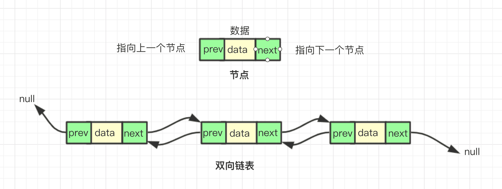

# 1. 链表
链表和数组一样，可以存储一系列的元素，但是链表和数组的实现机制完全不同

数组：
- 要存储多个元素，数组（或者称为列表）可能是最常用的数组结构
- 几乎每一种语言都有默认实现数组结构
  
数组的缺点：
- 数组的创建通常需要申请一段连续的内存空间（一整块内存），并且大小是固定的，所以当当前数组不能满足容量要求时，需要扩容（一般情况下是申请一个更大的数组，比如2倍，然后将原数组中的元素复制过去）
- 数组在开头或者中间位置插入数据的成本很高，需要进行大量的位移
- 尽管JavaScript的Array类方法可以帮我们做这些事，但是背后的原理依然是这样


要存储多个元素，另外一个选择就是链表

- 不用于数组，链表中的元素在内存中不必是连续的空间
- 链表的每个元素由一个存储元素本身的节点和一个指向下一个元素的引用（有些语言称之为指针或者连接）组成

链表的优点：
- 内存空间不是必须连续的，可以充分利用计算机的内存，实现灵活的内存动态管理
- 链表不必在创建时就确定大小，并且大小可以无限的延伸下去
- 链表在插入和删除数据时，时间复杂度可以达到O(1),相对数组效率高很多


链表的缺点：
- 链表访问任何一个位置的元素时，都需要从头开始访问（无法跳过第一个元素访问一个元素）
- 无法通过下标直接访问元素，需要从头一个一个访问，直到找到对应的元素

链表的火车结构：
链表类似于火车，有一个火车头，火车头会连接一个节点，节点上有乘客（类似于数据），并且这个节点会连接下一个节点，以此类推


# 2. 链表结构的封装
```html
<script>
    // 封装链表类
    function LinkedList(){
        // 内部的类：节点类
        function Node(data,next){
            this.data=data
            this.next=null
        }
        // 属性
        this.head=ull
        this.length=0

    }
</script>
```

# 3. 链表常见操作
- append(element):向链表尾部添加一个新的项
- insert(position,element):向链表的特定位置插入一个新的项
- get(position):获取对应位置的元素
- indexOf(element):返回元素在链表中的索引，如果链表中没有该元素则返回-1
- update(position,element):修改某个位置的元素
- removeAt(position):从链表中的特定位置移除一项
- remove(element):从链表中移除一项
- isEmpty():如果链表中不包含任何元素，返回true，如果链表长度大于0则返回false
- size():返回链表包含的元素个数，与数组的length属性类似
- toString():由于列表项使用了Node类，就需要重写继承自JavaScript对象默认的toString方法，让其只输出元素的值

## 3.1. append方法
```js
// 1. 追加方法append
LinkedList.prototype.append = function (data) {
    // 1. 创建新节点
    var newNode = new Node(data)

    // 2. 判断是否添加的是第一个节点
    if (this.length == 0) { //2.1. 是第一个节点
        this.head = newNode
    } else { //2.2. 不是第一个节点

        // 找到最后一个节点
        var newNode = new Node(data)

        var current = this.head
        while (current.next) {
            current = current.next
        }

        // 最后节点的next指向新的节点
        current.next = newNode
    }
    // 3. length+1
    this.length += 1
}
```
## 3.2. toString方法
- 从head开头，因为获取链表的任何元素都必须才能够第一个节点开头
- 循环遍历每一个节点，并且取出其中的一个element,拼接成字符串
- 将最终字符串返回

```js
// 2. toString方法
LinkedList.prototype.toString = function () {
    // 1. 定义变量
    var current = this.head
    var listString = ""

    // 2. 循环获取一个个的节点
    while (current) {
        listString += current.data + " "
        current = current.next
    }
    return listString
}
```

## 3.3. insert方法
```js
// 3. insert()方法
LinkedList.prototype.insert = function (position, data) {
    // 1. 对position 进行越界判断
    if (position < 0 || position > this.length) return false

    // 2. 根据data创建newNode
    var newNode = new Node(data)

    // 3. 判断插入的位置是否是第一个
    if (this.position == 0) {
        newNode.next = this.head
        this.head = newNord
    } else {
        var index = 0
        var current = this.head
        var previous = null
        while (index++ < position) {
            previous = current
            current = current.next
        }
        newNode.next = current
        previous.next = newNode
    }

    // 4. length+1
    this.length += 1
    return true
}
```

## 3.4. get方法
```js
// 4. get方法
LinkedList.prototype.get = function (position) {
    // 1. 越界判断
    if (position < 0 || position >= this.length) return null

    // 2. 获取对应的data
    var current = this.head
    var index = 0
    while (index++ < position) {
        current = current.next
        // index++
    }
    return current.data
}
```
## 3.5. indexOf方法
```js
LinkedList.prototype.indexOf = function (data) {
    // 1.定义变量
    var current = this.head
    var index = 0

    // 2. 开始寻找
    while (current) {
        if (current.data == data) {
            return index
        }
        current=current.next
        index += 1
    }
    // 找到最后也没有找到，返回-1
    return -1
}
```
## 3.6. update方法
```js
            // 6. update方法
LinkedList.prototype.update = function (position, newData) {

    // 1. 越界判断
    if (position < 0 || position >= this.length) return false

    // 2. 查找正确的节点
    var current = this.head
    var index = 0
    while (index++ < position) {
        current = current.next
    }

    // 3. 将position位置的node的data修改成新的newData
    current.data = newData
    return true
}
```


## 3.7. removeAt方法
```js
// 7.removeAt方法
LinkedList.prototype.removeAt = function (position) {
    // 1. 越界判断
    if (position < 0 || position >= this.length) return null

    // 2.判断是否删除的是第一个节点
    var current = this.head

    if (position == 0) {
        this.head = this.head.next
    } else {
        var index = 0
        var previous = null
        while (index++ < position) {
            previous = current
            current = current.next
        }
        // 前一个节点的next指向current的next即可
        previous.next = current.next
    }


    // 3. length-1
    this.length-=1
    return current.data
}
```


## 3.8. remove方法
```js
  // 8. remove方法
LinkedList.prototype.remove=function(data){

    // 1.根据data获取data在列表中的数据
    var position =this.indexOf(data)

    // 2. 根据位置信息，删除节点
    return this.removeAt(position)
}
```
## 3.9. isEmpty方法
```js
    // 9. isEmpty方法
LinkedList.prototype.isEmpty = function () {
    return this.length == 0
}
```

## 3.10. size方法
```js
// 10. size方法
LinkedList.prototype.size = function () {
    return this.length
```

# 4. 双向链表
双向链表：
- 既可以从头遍历到尾，又可以从尾遍历到头
- 链表相连的过程是双向的
- 一个节点既有向前连接的引用，也有一个向后连接的引用
- 双向链表可以有效解决单向链表很难回到前一个节点的问题

双向链表的缺点：
- 每次长在插入或者删除某个节点时，需要处理四个引用，而不是两个，也就是实现起来要困难一点
- 相对于单向列表，必然占用的内存空间更大一些




## 4.1. 双向链表的封装
```js
// 封装双向链表
function DoublyLinkedList(){

    // 内部类：节点类
    function Node(data){
        this.data=data
        this.prev=null
        this.next=null

    }

    // 属性
    this.head=null
    this.tail=null
    this.length=0


    // 常见的操作：方法

}
```
## 4.2. 双向链表的常见操作

基本上与单向链表的常见操作相同

新增了两个方法：
- forwardString():返回正向遍历的节点字符串形式
- backwordString():返回反向遍历的节点字符串形式

```html
<script>
    // 封装双向链表
    function DoublyLinkedList() {

        // 内部类：节点类
        function Node(data) {
            this.data = data
            this.prev = null
            this.next = null

        }

        // 属性
        this.head = null
        this.tail = null
        this.length = 0


        // 常见的操作：方法


        // 1. append方法
        // 1.append
        DoublyLinkedList.prototype.append = function (data) {
            var newNode = new Node(data);

            // 2.判断链表是否为空
            if (this.head == null) {
                this.head = newNode;
                this.tail = newNode;
            } else {
                this.tail.next = newNode;
                newNode.prev = this.tail;
                this.tail = newNode;
            }

            // 3.length+1
            this.length++;
        }


        // 2. 将链表转成字符串形式
        // 2.1. toString方法
        DoublyLinkedList.prototype.toString = function () {
            return this.backwordString()
        }

        // 2.2. forwardString方法
        DoublyLinkedList.prototype.forwardString = function () {
            // 1. 定义变量
            var current = this.tail
            var resultString = ""

            // 2. 依次向前遍历获取每一个节点
            while (current) {
                resultString += current.data + " "
                current = current.prev
            }
            return resultString
        }

        // 2.3. backwordString方法
        DoublyLinkedList.prototype.backwordString = function () {
            // 1. 定义变量
            var current = this.head
            var resultString = ""

            // 2. 依次向后遍历，获取每一个节点
            while (current) {
                resultString += current.data + ' '
                current = current.next
            }
            return resultString
        }


        // 3. insert 方法
        DoublyLinkedList.prototype.insert = function (position, data) {
            // 1. 越界判断
            if (position < 0 || position > this.length) return false

            // 2. 根据data创建新的节点
            var newNode = new Node(data)

            // 3. 判断原来的列表是否为空
            if (this.length == 0) {
                this.head = newNode
                this.tail = newNode
            } else {
                if (position == 0) {
                    // 3.1.判断position是否为0
                    this.head.prev = newNode
                    newNode.next = this.head
                    this.head = newNode
                } else if (position == this.length) { // 3.2. position==length
                    newNode.prev = this.tail
                    this.tail.next = newNode
                    this.tail = newNode
                } else { //3.3. 其他情况
                    var current = this.head
                    var index = 0

                    while (index++ < position) {
                        current = current.next
                    }

                    // 修改指针
                    newNode.next = current
                    newNode.prev = current.prev
                    current.prev.next = newNode
                    current.prev = newNode
                }
            }
            // 4. length+1
            this.length += 1
            return true
        }

        // 4. get方法
        DoublyLinkedList.prototype.get = function (position) {
            // 1. 越界判断
            if (position < 0 || position >= this.length) return null

            // 2. 获取元素
            var current = this.head
            var index = 0
            while (index++ < position) {
                current = current.next
            }
            return current.data
        }

        // 5. indexOf方法
        DoublyLinkedList.prototype.indexOf = function (data) {
            // 1. 定义变量
            var current = this.head
            var index = 0

            // 2. 查找和data相同的节点
            while (current) {
                if (current.data == data) {
                    return index
                }
                current = current.next
                index += 1
            }
            return -1
        }


        // 6. update方法
        DoublyLinkedList.prototype.update = function (position, newData) {
            // 1. 越界的判断
            if (position < 0 || position >= this.length) return false

            // 2. 寻找正确的节点
            var current = this.head
            var index = 0
            while (index++ < position) {
                current = current.next
            }

            // 3. 修改找到节点的data信息
            current.data = newData
            return true

        }

        // 7. removeAt方法
        DoublyLinkedList.prototype.removeAt = function (position) {
            // 1. 越界判断
            if (position < 0 || position >= this.length) return null

            // 2. 判断是否只有一个节点
            var current = this.head

            if (this.length == 1) {
                this.head = null
                this.tail = null

            } else {
                // 判断是否删除的是第一个节点
                if (position == 0) {
                    this.head.next.prev = null
                    this.head = this.head.next
                } else if (position == this.length - 1) { //最后的节点
                    current = this.tail
                    this.tail.prev.next = null
                    this.tail = this.tail.prev
                } else {
                    var index = 0

                    while (index++ < position) {
                        current = current.next
                    }

                    current.prev.next = current.next
                    current.next.prev = current.prev
                }
            }
            // 3. length-1
            this.length -= 1
            return current.data
        }

        // 8. remove方法
        DoublyLinkedList.prototype.remove = function (data) {
            // 1. 根据data获取下标值
            var index = this.indexOf(data)

            // 2. 根据index删除对应位置的节点
            return this.removeAt(index)
        }

        // 9. isEmpty方法
        DoublyLinkedList.prototype.isEmpty = function () {
            return this.length == 0
        }

        // 10. size方法
        DoublyLinkedList.prototype.size = function () {
            return this.length
        }

        // 11. 获取链表的第一个元素
        DoublyLinkedList.prototype.getHead = function () {
            return this.head.data
        }

        // 12. 获取链表的最后一个元素
        DoublyLinkedList.prototype.getTail = function () {
            return this.tail.data
        }


    }


    // 测试代码
    var list = new DoublyLinkedList()

    list.append('a')
    list.append('b')
    list.append('c')
    list.append('d')
    list.append('e')
    list.append('f')
    list.append('g')

    // 2. 测试转成字符串的方法
    // alert(list)
    // alert(list.backwordString())
    // alert(list.forwardString())


    // 3. 测试insert方法
    // list.insert(0,'fist')
    // list.insert(7,'last')
    // list.insert(4,'mid')

    // alert(list)


    // 4. 测试get方法
    // alert(list.get(0))
    // alert(list.get(6))
    // alert(list.get(3))


    // 5. 测试indexOf方法
    // alert(list.indexOf('a'))
    // alert(list.indexOf('g'))
    // alert(list.indexOf('d'))


    // 6. 测试update方法
    // list.update(0,'first')
    // list.update(6,'last')
    // list.update(3,'mid')

    // alert(list)

    // 7. 测试remove方法
    // alert(list.removeAt(0))
    // alert(list)
    // alert(list.removeAt(5))
    // alert(list)

    // 8. 测试remove方法
    // alert(list.remove('a'))
    // alert(list)

    // 9. 测试其他方法
    // alert(list.isEmpty())
    // alert(list.size())
    // alert(list.getHead())
    // alert(list.getTail())
</script>
```


