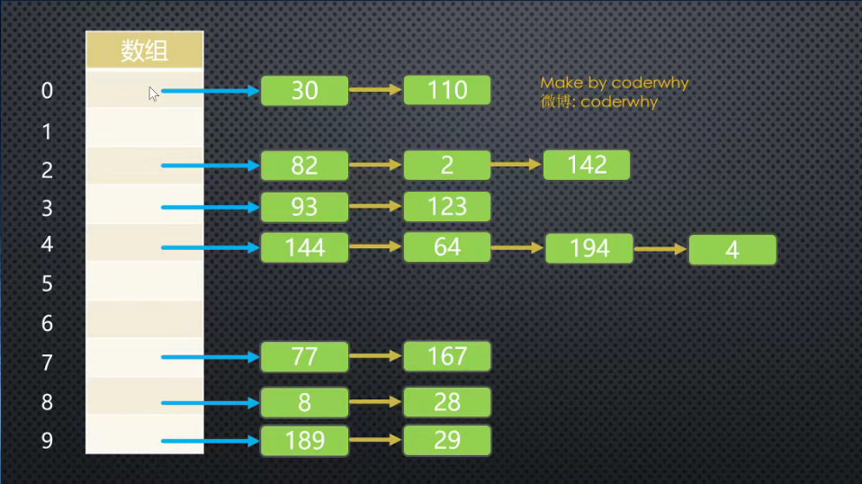
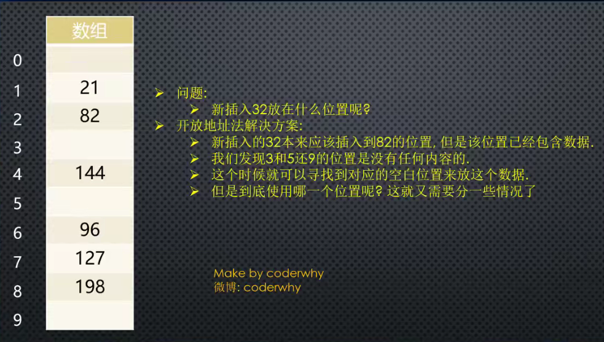

# 1. 集合结构
- 几乎每一种编程语言中，都有集合结构
- 集合比较常见的实现方式是**哈希表**，我们这里来实现一个封装的集合类
- 集合通常是由一组**无序的，不能重复**的元素构成
  - 和数学中的集合比较相似，但是数学中的集合范围更大一些，也允许集合中的元素重复
  - 在计算机中，集合通常表示的结构中**元素是不允许重复**的

集合可以看做一个特殊的数组
- 特殊之处在于里面的元素没有顺序，也不能重复
- 没有顺序意味着不能通过下标值进行访问，不能重复意味着相同的对象在集合中只会存在一份

ES6中包含了set类，其实不用封装它，可以直接使用

## 1.1. 创建集合类
```js
    <script>
        // 封装集合类
        function Set() {
            // 属性
            this.items = {}

            // 方法

            // add方法
            Set.prototype.add = function (value) {
                // 判断当前集合中是否已经包含了该元素
                if (this.has(value)) {
                    return false
                }
                // 将元素添加到集合中
                this.items[value] = value
                return true


                // has方法
                Set.prototype.has = function (value) {
                    return this.items.hasOwnProperty(value)
                }


                // remove方法
                Set.prototype.remove=function(value){
                    // 1. 判断该集合中是否包含该元素
                    if(!this.has(value)){
                        return false
                    }

                    // 2.将元素从属性中删除
                    delete this.items[value]
                    return true
                }

                // clear方法
                Set.prototype.clear=function(){
                    this.items={}
                }

                // size方法
                Set.prototype.size=function(){
                    return Object.keys(this.items).length
                }

                // values方法
                Set.prototype.values=function(){
                    return Object.keys(this.items)
                }
            }

        }
    </script>
```
## 1.2. 集合常见的操作
- add(value):向集合添加一个新的项
- remove(value):从集合移除一个值
- has(value):如果值在集合中，返回true，否则返回false
- clear():移除集合中的所有项
- size():返回集合所包含元素的数量。与数组的length属性类似
- values():返回一个包含集合中所有值的数组
- 其他操作

## 1.3. 集合之间的操作
集合间通常有如下操作：
- 并集：对于给定的两个集合，返回一个包含两个集合中所有元素的新集合
- 交集：对于给定的两个集合，返回一个包含两个集合中共有元素的新集合
- 差集：对于给定的两个集合，返回一个包含所有存在于第一个集合且不存在于第二个集合的元素的新集合
- 子集：验证一个给定集合是否是另一个集合的子集

### 1.3.1. 并集实现
代码解析：
- 首先需要创建一个新的集合，代表两个集合的并集
- 遍历集合1中所有的值，并且添加到新集合中
- 遍历集合2中所有的值并进行判断，将集合1中没有的元素添加到新集合中
- 将最终的新集合返回


```js
// 并集
Set.prototype.union = function (otherSet) {
    // this:集合对象A
    // otherSet:集合对象B

    // 1. 创建一个新的集合
    var unionSet = new Set()

    // 2.将A集合中所有的元素添加到新集合中
    var values = this.values()
    for (var i = 0; i < values.length; i++) {
        unionSet.add(values[i])
    }

    // 3.取出B集合中的元素，判断是否需要加到新集合
    values = otherSet.values()
    for (var i = 0; i < values.length; i++) {
        unionSet.add(values[i])
    }
    return unionSet
}
```
### 1.3.2. 交集的实现
代码解析：
- 创建一个新的集合
- 遍历集合1中所有元素，判断是否该元素在集合2中
- 同时在集合2中，将该元素加入到新集合中
- 将最终的新集合返回

```js
// 交集
Set.prototype.intersation = function (otherSet) {
    // 1. 创建一个新的集合
    var intersectionSet = new Set()

    // 2. 从A中取出元素，判断是否同时存在于集合B中，存在放入新集合中
    var values = this.values()

    for (var i = 0; i < values.length; i++) {
        var item = values[i]
        if (otherSet.has(item)) {
            intersectionSet.add(item)
        }
    }

    return intersectionSet
}
```


### 1.3.3. 差集实现
代码解析：
- 创建一个新的集合
- 遍历集合1中国所有的元素，判断是否在集合2中
- 不存在于集合2中，将该元素添加到新集合中
- 将新集合返回

```js
// 差集
Set.prototype.difference=function(otherSet){
    // 1. 创建一个新的集合
    var differenceSet=new Set()

    // 2. 取出A集合一个个元素，判断是否同时存在于B中，不存在B中，则添加到新集合中
    var values=this.values()
    for (var i=0;i<values.length;i++){
        var item=values[i]
        if(!otherSet.has(item)){
            differenceSet.add(item)
        }
    }

    return differenceSet
}
```

### 1.3.4. 子级实现
代码解析：
- 判断集合1是否大于集合2，如果大于，那么肯定不是集合2的子集
- 不大于的情况下：
  - 判断集合1中的元素是否都在集合2中存在
  - 存在，那么是集合2的子集
  - 有一个不存在，那么不是集合2的子集

```js
// 子集
Set.prototype.subset=function(otherSet){
    // 遍历集合A中所有的元素，如果发现，集合A中的元素，在集合B中不存在，那么false
    // 如果遍历完了整个集合，依然没有返回false,那么返回true即可

    var values=this.values()
    for (var i=0;i<values.length;i++){
        var item=values[i]
        if(!otherSet.has(item)){
            return false
        }
    }
    return true
}
```

# 2. 字典
集合、数组、字典是几乎所有编程语言都会默认提供的数据类型

## 2.1. 字典的特点
- 字典的主要特点是**一一对应**的关系
- 可以通过key取出value
- 字典中的key是不可以重复的，而value可以重复，并且字典中的key是无序的


## 2.2. 字典和映射的关系
- 有些编程语言中称这种**映射关系**为字典，因为它确实和生活中的字典比较相似（比如Swift中的Dictionary，Python中的dict）
- 有些语言中称这种映射关系为`Map`，（比如Java中就有HashMap&TreeMap）

## 2.3. 字典和数组
- 字典和数组对比的话，字典可以非常方便的通过Key来搜索对应的value，key可以包含特殊含义，也更容易被人记住

## 2.4. 字典和对象
- 很多编程语言（如Java）中对字典和对象区分比较明显，对象通常是一种在编译器就确定下来的结构，不可以动态的添加或者删除属性，而字典通常会使用类似于**哈希表**的数据结构去实现一种可以动态的添加数据的结构
- 在JavaScript中，似乎对象本身就是一种字典，所以在早期的JavaScript中，没有字典这种数据类型，因为你完全可以使用对象去替代

# 3. 哈希表
## 3.1. 哈希表介绍
几乎所有的编程语言都有直接或者简介的应用这种数据结构

哈希表通常是基于数组进行实现的，但是相对于数组，它有很多优势：
- 它可以提供非常快速的**插入-删除-查找**操作
- 无论多少数据，插入和删除需要接近常量的时间：即O(1)的时间级。实际上，只需要几个机器指令即可完成
- 哈希表的速度比树还要快，基本上可以瞬间查找到想要的元素
- 哈希表相对于树来说编码要容易很多

哈希表相对于数组的一些不足：
- 哈希表中的数据是没有顺序的，所以不能以一种固定的方式（比如从小到大）来遍历其中的元素
- 通常情况下，哈希表中的key是不允许重复的，不能放置相同的key，用于保存不同的元素

## 3.2. 哈希表到底是什么？
哈希表的结构就是数组，但是它神奇的地方在于**对下标值的一种变换**，这种变换我们称之为**哈希函数**，通过哈希函数可以获取到`HashCode`

> 将字符串转成下标值，就是哈希函数

## 3.3. 哈希表的一些概念
> 哈希化：将大数字转化成数组范围内下标的过程，我们就称之为哈希化

> 哈希函数：通常我们希望将单词转成大数字，大数字在进行哈希化的代码实现放在一个函数中，这个函数我们称为哈希函数

> 哈希表：最终将数据插入到的这个数组，对整个结构的封装，我们就称之为一个哈希表

## 3.4. 冲突
尽管50000个单词，我们使用了100000个位置来存储，并且通过一种相对比较好的哈希函数来完成，但是依然可能发生冲突

解决冲突的两种方案：
- 链地址法
- 开放地址法

### 3.4.1. 链地址法
链地址法是比较常见的解决冲突的方案（也称为拉链法）




图片解析：
- 从图片中 我们可以看出，链地址法解决冲突的方法是每个数组单元中存储的不再是单个数据，而是一个链表
- 这个链表使用的数据结构常见的是数组或者链表
- 如果是链表，就是每个数组单元中存储这一个链表，一旦发现重复，将重复的元素插入到链表的首端或者末端即可
- 当查询时，先根据哈希化后的下标值找到对应的位置，再取出链表，依次查询寻找的数据


数组/链表？
- 数组和链表这里都可以，效率上也差不多
- 因为根据哈希化的index找出这个数组或者链表时，通常就会使用线性查找，这个时候数组或者链表的效率是差不多的
- 当然在某些实现中，会将新插入的数据放在数组或者链表的最前面，因为觉得新插入的数据用于取出的可能性更大
- 这种情况最好采用链表，因为数组在首位插入数据是需要所有项都往后移动，链表没有这个问题

### 3.4.2. 开放地址法
开放地址法的主要工作方式是寻找空白的单元格来添加重复的数据


图片解析：
从图片中我们可以了解到，开放地址法其实就是要寻找空白的位置来放置冲突的数据项

但是探索这个位置的方式不同，有三种方法：
- 线性探测
- 二次探测
- 再哈希法

#### 线性探测
线性的查找空白的单元

###### 插入的32：
经过哈希化得到的index=2，但是在插入的时候，发现该位置已经有82，
线性探测就是从index+1的位置开始一点点查找合适的位置来放置32，
空的位置就是合适的位置，在我们图中的例子就是index=3的位置


###### 查询32：
首先经过哈希化得到index=2,比较2的位置和查询的数值是否相同，相同就直接返回
不相同就线性查找，从index+1开始查找


如果32的位置我们之前没有插入，是否将整个哈希表查询一遍来确定32存不存在呢？
不是，查询过程有一个约定，就是查询到空位置就结束，因为查询到这里有空位置，32之前不可能跳过空位置到其他的位置


