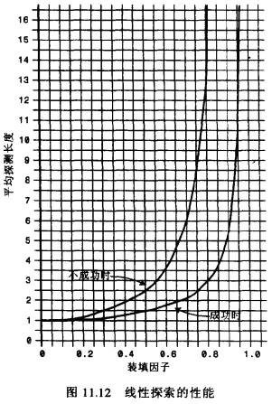
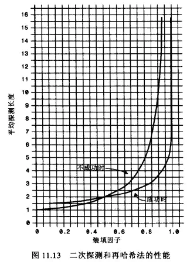
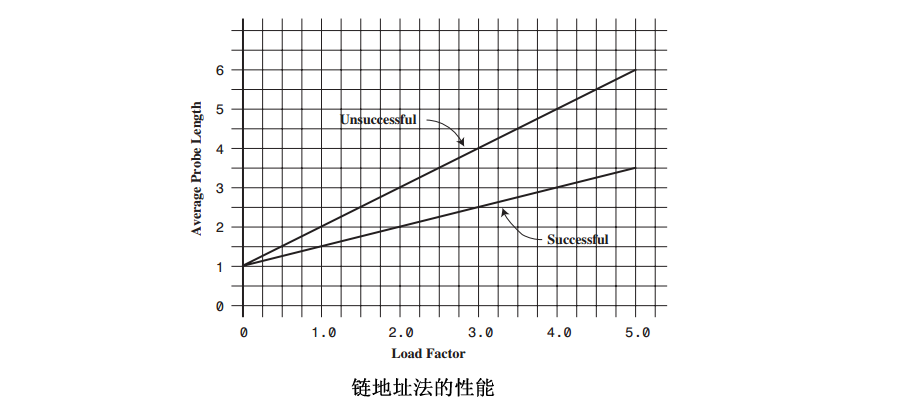
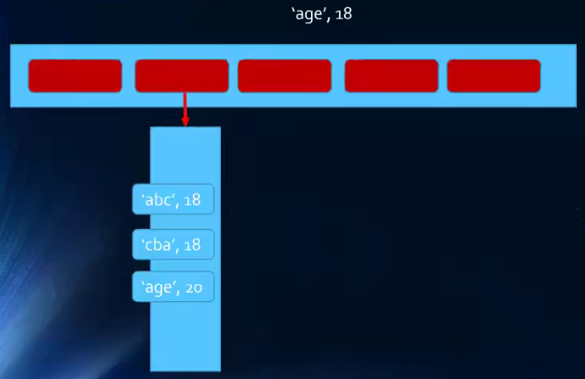

# 1. 集合结构
- 几乎每一种编程语言中，都有集合结构
- 集合比较常见的实现方式是**哈希表**，我们这里来实现一个封装的集合类
- 集合通常是由一组**无序的，不能重复**的元素构成
  - 和数学中的集合比较相似，但是数学中的集合范围更大一些，也允许集合中的元素重复
  - 在计算机中，集合通常表示的结构中**元素是不允许重复**的

集合可以看做一个特殊的数组
- 特殊之处在于里面的元素没有顺序，也不能重复
- 没有顺序意味着不能通过下标值进行访问，不能重复意味着相同的对象在集合中只会存在一份

ES6中包含了set类，其实不用封装它，可以直接使用

## 1.1. 创建集合类
```js
    <script>
        // 封装集合类
        function Set() {
            // 属性
            this.items = {}

            // 方法

            // add方法
            Set.prototype.add = function (value) {
                // 判断当前集合中是否已经包含了该元素
                if (this.has(value)) {
                    return false
                }
                // 将元素添加到集合中
                this.items[value] = value
                return true


                // has方法
                Set.prototype.has = function (value) {
                    return this.items.hasOwnProperty(value)
                }


                // remove方法
                Set.prototype.remove=function(value){
                    // 1. 判断该集合中是否包含该元素
                    if(!this.has(value)){
                        return false
                    }

                    // 2.将元素从属性中删除
                    delete this.items[value]
                    return true
                }

                // clear方法
                Set.prototype.clear=function(){
                    this.items={}
                }

                // size方法
                Set.prototype.size=function(){
                    return Object.keys(this.items).length
                }

                // values方法
                Set.prototype.values=function(){
                    return Object.keys(this.items)
                }
            }

        }
    </script>
```
## 1.2. 集合常见的操作
- add(value):向集合添加一个新的项
- remove(value):从集合移除一个值
- has(value):如果值在集合中，返回true，否则返回false
- clear():移除集合中的所有项
- size():返回集合所包含元素的数量。与数组的length属性类似
- values():返回一个包含集合中所有值的数组
- 其他操作

## 1.3. 集合之间的操作
集合间通常有如下操作：
- 并集：对于给定的两个集合，返回一个包含两个集合中所有元素的新集合
- 交集：对于给定的两个集合，返回一个包含两个集合中共有元素的新集合
- 差集：对于给定的两个集合，返回一个包含所有存在于第一个集合且不存在于第二个集合的元素的新集合
- 子集：验证一个给定集合是否是另一个集合的子集

### 1.3.1. 并集实现
代码解析：
- 首先需要创建一个新的集合，代表两个集合的并集
- 遍历集合1中所有的值，并且添加到新集合中
- 遍历集合2中所有的值并进行判断，将集合1中没有的元素添加到新集合中
- 将最终的新集合返回


```js
// 并集
Set.prototype.union = function (otherSet) {
    // this:集合对象A
    // otherSet:集合对象B

    // 1. 创建一个新的集合
    var unionSet = new Set()

    // 2.将A集合中所有的元素添加到新集合中
    var values = this.values()
    for (var i = 0; i < values.length; i++) {
        unionSet.add(values[i])
    }

    // 3.取出B集合中的元素，判断是否需要加到新集合
    values = otherSet.values()
    for (var i = 0; i < values.length; i++) {
        unionSet.add(values[i])
    }
    return unionSet
}
```
### 1.3.2. 交集的实现
代码解析：
- 创建一个新的集合
- 遍历集合1中所有元素，判断是否该元素在集合2中
- 同时在集合2中，将该元素加入到新集合中
- 将最终的新集合返回

```js
// 交集
Set.prototype.intersation = function (otherSet) {
    // 1. 创建一个新的集合
    var intersectionSet = new Set()

    // 2. 从A中取出元素，判断是否同时存在于集合B中，存在放入新集合中
    var values = this.values()

    for (var i = 0; i < values.length; i++) {
        var item = values[i]
        if (otherSet.has(item)) {
            intersectionSet.add(item)
        }
    }

    return intersectionSet
}
```


### 1.3.3. 差集实现
代码解析：
- 创建一个新的集合
- 遍历集合1中国所有的元素，判断是否在集合2中
- 不存在于集合2中，将该元素添加到新集合中
- 将新集合返回

```js
// 差集
Set.prototype.difference=function(otherSet){
    // 1. 创建一个新的集合
    var differenceSet=new Set()

    // 2. 取出A集合一个个元素，判断是否同时存在于B中，不存在B中，则添加到新集合中
    var values=this.values()
    for (var i=0;i<values.length;i++){
        var item=values[i]
        if(!otherSet.has(item)){
            differenceSet.add(item)
        }
    }

    return differenceSet
}
```

### 1.3.4. 子级实现
代码解析：
- 判断集合1是否大于集合2，如果大于，那么肯定不是集合2的子集
- 不大于的情况下：
  - 判断集合1中的元素是否都在集合2中存在
  - 存在，那么是集合2的子集
  - 有一个不存在，那么不是集合2的子集

```js
// 子集
Set.prototype.subset=function(otherSet){
    // 遍历集合A中所有的元素，如果发现，集合A中的元素，在集合B中不存在，那么false
    // 如果遍历完了整个集合，依然没有返回false,那么返回true即可

    var values=this.values()
    for (var i=0;i<values.length;i++){
        var item=values[i]
        if(!otherSet.has(item)){
            return false
        }
    }
    return true
}
```

# 2. 字典
集合、数组、字典是几乎所有编程语言都会默认提供的数据类型

## 2.1. 字典的特点
- 字典的主要特点是**一一对应**的关系
- 可以通过key取出value
- 字典中的key是不可以重复的，而value可以重复，并且字典中的key是无序的


## 2.2. 字典和映射的关系
- 有些编程语言中称这种**映射关系**为字典，因为它确实和生活中的字典比较相似（比如Swift中的Dictionary，Python中的dict）
- 有些语言中称这种映射关系为`Map`，（比如Java中就有HashMap&TreeMap）

## 2.3. 字典和数组
- 字典和数组对比的话，字典可以非常方便的通过Key来搜索对应的value，key可以包含特殊含义，也更容易被人记住

## 2.4. 字典和对象
- 很多编程语言（如Java）中对字典和对象区分比较明显，对象通常是一种在编译器就确定下来的结构，不可以动态的添加或者删除属性，而字典通常会使用类似于**哈希表**的数据结构去实现一种可以动态的添加数据的结构
- 在JavaScript中，似乎对象本身就是一种字典，所以在早期的JavaScript中，没有字典这种数据类型，因为你完全可以使用对象去替代

# 3. 哈希表
## 3.1. 哈希表介绍
几乎所有的编程语言都有直接或者简介的应用这种数据结构

哈希表通常是基于数组进行实现的，但是相对于数组，它有很多优势：
- 它可以提供非常快速的**插入-删除-查找**操作
- 无论多少数据，插入和删除需要接近常量的时间：即O(1)的时间级。实际上，只需要几个机器指令即可完成
- 哈希表的速度比树还要快，基本上可以瞬间查找到想要的元素
- 哈希表相对于树来说编码要容易很多

哈希表相对于数组的一些不足：
- 哈希表中的数据是没有顺序的，所以不能以一种固定的方式（比如从小到大）来遍历其中的元素
- 通常情况下，哈希表中的key是不允许重复的，不能放置相同的key，用于保存不同的元素

## 3.2. 哈希表到底是什么？
哈希表的结构就是数组，但是它神奇的地方在于**对下标值的一种变换**，这种变换我们称之为**哈希函数**，通过哈希函数可以获取到`HashCode`

> 将字符串转成下标值，就是哈希函数

## 3.3. 哈希表的一些概念
> 哈希化：将大数字转化成数组范围内下标的过程，我们就称之为哈希化

> 哈希函数：通常我们希望将单词转成大数字，大数字在进行哈希化的代码实现放在一个函数中，这个函数我们称为哈希函数

> 哈希表：最终将数据插入到的这个数组，对整个结构的封装，我们就称之为一个哈希表

## 3.4. 冲突
尽管50000个单词，我们使用了100000个位置来存储，并且通过一种相对比较好的哈希函数来完成，但是依然可能发生冲突

解决冲突的两种方案：
- 链地址法
- 开放地址法

### 3.4.1. 链地址法
链地址法是比较常见的解决冲突的方案（也称为拉链法）


图片解析：
- 从图片中 我们可以看出，链地址法解决冲突的方法是每个数组单元中存储的不再是单个数据，而是一个链表
- 这个链表使用的数据结构常见的是数组或者链表
- 如果是链表，就是每个数组单元中存储这一个链表，一旦发现重复，将重复的元素插入到链表的首端或者末端即可
- 当查询时，先根据哈希化后的下标值找到对应的位置，再取出链表，依次查询寻找的数据


数组/链表？
- 数组和链表这里都可以，效率上也差不多
- 因为根据哈希化的index找出这个数组或者链表时，通常就会使用线性查找，这个时候数组或者链表的效率是差不多的
- 当然在某些实现中，会将新插入的数据放在数组或者链表的最前面，因为觉得新插入的数据用于取出的可能性更大
- 这种情况最好采用链表，因为数组在首位插入数据是需要所有项都往后移动，链表没有这个问题

### 3.4.2. 开放地址法
开放地址法的主要工作方式是寻找空白的单元格来添加重复的数据


图片解析：
从图片中我们可以了解到，开放地址法其实就是要寻找空白的位置来放置冲突的数据项

但是探索这个位置的方式不同，有三种方法：
- 线性探测
- 二次探测
- 再哈希法

#### 线性探测
线性的查找空白的单元

###### 插入的32：
经过哈希化得到的index=2，但是在插入的时候，发现该位置已经有82，
线性探测就是从index+1的位置开始一点点查找合适的位置来放置32，
空的位置就是合适的位置，在我们图中的例子就是index=3的位置


###### 查询32：
首先经过哈希化得到index=2,比较2的位置和查询的数值是否相同，相同就直接返回
不相同就线性查找，从index+1开始查找


如果32的位置我们之前没有插入，是否将整个哈希表查询一遍来确定32存不存在呢？
不是，查询过程有一个约定，就是查询到空位置就结束，因为查询到这里有空位置，32之前不可能跳过空位置到其他的位置

###### 删除32
删除和插入查询比较类似，但是也有一个特别注意点：
删除操作一个数据项时，不可以将这个位置的下标内容设置为null
将它设置为null可能会影响我们之后查询其他操作，所以通常删除一个位置的数据项时，我们可以将它进行特殊处理（比如设置为-1）
当我们之后看到-1位置的数据项时，就知道查询时要继续查询，但是插入时这个位置可以放置数据

###### 线性探测的问题
线性探测有一个比较严重的问题，就是聚集
比如我们在没有任何数据的时候，插入的是22,23,24,25,26,那么意味着下标值：2，3，4，5，6的位置都有元素
这种一连串填充单元就叫做聚集
聚集会影响哈希表的性能，无论是插入/查询/删除都有影响
比如我们插入一个32，就会发现连续的单元都不允许我们放置数据，并且在这个过程中我们需要探索多次
二次探测可以解决一部分这个问题

#### 二次探测
线性探测存在的问题：如果之前的数据是连续插入的，那么新插入的一个数据就可能需要探测很长的距离

二次探测在线性探测的基础上进行了优化：
二次探测主要优化的是探测时的**步长**

线性探测，我们可以看成是步长为1的探测
二次探测，对步长做了优化，比如从下标值x开始，x+1^2,x+2^2,x+3^2
这样就可以一次性探测较长的距离，避免哪些聚集带来的影响

###### 二次探测的问题
比如我们连续插入的是32,112,82,2,192,那么他们依次累加的时候的步长是相同的
也就是这种情况会造成步长不一的一种聚集，还是会影响效率（当然这种可能性相对于连续的数字会小一些）

从根本上解决这个问题，让每个人的步长不一样，需要再哈希法

#### 再哈希法
二次探测的算法产生的探测序列步长是固定的：1,4,9,16以此类推
现在需要一种算法：产生一种依赖关键字的探测序列，而不是每一个关键字都一样
那么不同的关键字及时映射到相同的数组下标，也可以使用不同的探测序列
再哈希法的做法就是：**把关键字用另外一个哈希函数，再做一次哈希化，用这次哈希化的结果作为步长**
对于指定的关键字，步长在整个探测中是不变的，不过不同的关键字使用不同的步长

###### 第二次哈希化需要具备如下特点：
- 和第一个哈希函数不同
- 不能输出为0（否则将没有步长，每次探测都是原地踏步）

###### 一种工作很好的哈希函数：

stepSize=constant-(key%constant)
其中constant是质数，且小于数组的容量
例如：stepSize=5-(key%5),满足需求，并且结果不可能为0

## 3.5. 哈希化的效率
哈希表中执行插入和搜索操作效率是非常高的

- 如果没有产生冲突，那么效率会更高
- 如果产生冲突，存取事件就依赖后来的探测长度
- 平均探测长度以及平均存取时间，取决于填装因子，随着填装因子的变大，探测长度也越来越长
- 随着填装因子变大，效率下降的情况，在不同开放地址法方案中比链地址法更严重

#### 填装因子
填装因子表示当前哈希表中已经包含的数据项和整个哈希表长度的比值
填装因子=总数据项/哈希表长度
- 开放地址法中填装因子最大是1，因为它必须找到空白的单元才能将元素放入
- 链地址法的填装因子可以大于1，因为链地址法可以无限的延伸下去

### 3.5.1. 线性探测效率
探测序列(P)和填装因子(L)的关系：
- 对成功的查找：P=(1+1/(1-L)^2)/2
- 对不成功的查找：P=(1+1/(1-L))/2



### 3.5.2. 二次探测和在哈希化
二次探测和再哈希化的性能相当。他们的性能比线性探测略好
- 对成功的搜索：-log2(1-loadFactor)/loadFactor
- 对于不成功的搜索：1/(1-loadFactor)



### 3.5.3. 链地址法的性能
假如哈希表包含arraySize个数据项，每个数据项有一个链表，在表中一共包含N个数据项
那么平均每个链表有N/arraySize个数据项，即填装因子

- 成功的查找只需要查找链表的一半即可：1+loadFactor/2
- 不成功可能需要将整个链表查询完才知道不成功：1+loadFactor




经过比较可以发现，链地址法相对来说效率是好于开放地址法的

在真实开发中，使用链地址法的情况较多
- 链地址法不会因为添加了某元素后性能急剧下降
- Java中的HashMap就是使用的链地址法

## 3.6. 哈希函数
好的哈希函数应该尽可能的让计算过程变得简单，提交计算的效率
哈希表的主要优点是它的速度，如果在速度上不能满足，那么就达不到设计的目的了
提高速度的一个办法就是让哈希函数中尽量少的有乘法和除法，因为它们的性能是比较低的


哈希函数应该具备的有点：
- 快速的计算
  哈希表的优势在于效率，所以快速获取到对应的hashCode非常重要
  我们需要通过快速的计算来获取到元素对应的hashCode
- 均匀的分布
  哈希表中，无论是链地址法还是开放地址法，当多个元素映射到同一个位置的时候，都会影响效率
  所以，优秀的哈希函数应该尽可能将元素映射到不同的位置，让元素在哈希表中均匀的分布

### 3.6.1. 快速计算：霍纳法则
多项式的优化：霍纳法则
通过如下变换可以得到一种快得多的算法，即：
Pn(x)=anx^n+a(n-1)x^(n-1)+a1x+a0=((...(((anx+an-1)x+an-2)x+an-3)...)x+a1)x+a0
这种求值的安排我们称为霍纳法则
变换后我们需要多少次乘法和加法？
- N次乘法
- N次加法

### 3.6.2. 均匀分布
在设计哈希表时，我们已经有办法处理映射到相同下标值的情况：链地址法或者开放地址法
但是无论哪种方案，为了提供效率，最好的情况还是让数据在哈希表中均匀分布
因此我们需要在使用常量的地方，尽量使用质数

质数的使用：
- 哈希表的长度
- N次幂的底数（像是之前使用的27）

质数的使用在再哈希法中非常重要，但是在链地址法中没那么重要，甚至在Java中故意是2的N次幂
## 3.7. Java中的HashMap
Java中的哈希表使用的是链地址法
HashMap的初始长度是16，每次自动扩展，长度必须是2的次幂
这是为了服务于Key映射到index的算法

HashMap中为了提高效率，采用了位运算的方式
HashMap中Index的计算方式：index=HashCode(key)&(length-1)

比如计算book的HashCode：结果为十进制的3029737，二进制的1011100011101011101001
假定HashMap的长度是16，计算Length-1的结果是十进制的15，二进制的1111
把两个结果做与运算，1011100011101011101001&1111=1001，十进制是9，所以index=9

## 3.8. 哈希函数的实现
```js
// 设计哈希函数

// 将字符串转成一个比较大的数字：hashCode
// 将大的数字hashCode压缩到数组范围（大小）之内
function hashFunc(str, size) {
    // 1. 定义hashCode变量
    var hashCode=0

    // 2. 霍纳法则，计算hashCode的值
    for (var i=0;i<str.length;i++){
        // str.charCodeAt(i)
        hashCode=37*hashCode+str.charCodeAt(i)
    }

    // 3. 取余操作
    var index=hashCode%size
    return index
}

// 测试哈希函数
alert(hashFunc('abc',7))  
alert(hashFunc('hgeig',7))  
alert(hashFunc('dga',7))  
alert(hashFunc('gdgagrae',7))  
```
## 3.9. 创建哈希表
我们这里采用链地址法来实现哈希表
实现的哈希表（基于storge的数组）每个index对应的是一个数组（bucket).（当然基于链表也可以）
bucket中存放什么呢？我们最好将key和value都放进去，我们继续使用一个数组（其实其他语言使用元组更好）
最后我们的哈希表的数据格式是这样的：[[[key,value],[key,value],[key,value]],[[key,value],[key,value]],[[key,value]]]

### 3.9.1.  哈希表的属性
我们定义了三个属性：
- storge作为我们的数组，数组中存放相关的元素
- count表示当前已经存在了多少数据
- limit用于标记数组中一共可以存放多少个元素
```js
this.storge = []
this.count = 0 //当前数组已经存放的元素个数
// loadFactor >0.75 需要对数组进行扩容
// loadFactor<0.25 需要对数组进行减小容量
this.limit = 7 //数组长度
```

### 3.9.2. 插入&修改数据方法
哈希表的插入和修改操作是同一个函数，因为当使用者传入一个[key,value]时：
- 如果原来不存在该key，就是插入操作
- 如果原来已经存在该key，就是修改操作

##### 思路：
1. 根据key获取索引值，目的是将数据插入到对应的位置
2. 根据索引值取出bucket
   - 如果bucket不存在，创建bucket，并且防止在该索引的位置
   - 如果bucket存在，进行下面的操作
3. 判断是新增还是修改原来的值
   - 如果已经有值了，那么就修改原来的值
   - 如果没有值，执行后面的添加操作
4. 执行新增操作



```js
// 插入&修改操作
HashTable.prototype.put = function (key, value) {
    // 1. 根据key获取index
    var index = this.hashFunc(key, this.limit)

    // 2. 根据index取出对应的bucket
    var bucket = this.storge[index]

    // 3. 判断该bucket是否为null
    if (bucket == null) {
        bucket = []
        this.storge[index] = bucket
    }

    // 4. 判断是否是修改数据
    for (var i = 0; i < bucket.length; i++) {
        var tuple = bucket[i]

        if (tuple[0] == key) {
            tuple[1] = value
            return
        }
    }

    // 5. 添加操作
    bucket.push([key, value])
    this.count += 1
}
```

### 3.9.3. 获取方法
##### 思路：
1. 根据key获取对应的index
2. 根据index获取对应的bucket
3. 判断bucket是否为null
   - 如果为null，直接返回null
   - 如果不为null,进行下一步操作
4. 线性查找bucket中每一个key是否等于传入的key
   - 如果等于，直接返回对应的value
5. 遍历完后，依然没有找到对应的key
   - 直接返回 null即可


```js
// 获取操作
HashTable.prototype.get=function(key){
    // 1. 根据key获取对应的index
    var index=this.hashFunc(key,this.limit)

    // 2. 根据index获取对应的bucket
    var bucket =this.storge[index]

    // 3. 判断bucket是否为null
    if(bucket==null){
        return null
    }

    // 4. 有bucket，遍历bucket进行线性查找
    for (var i=0;i<bucket.length;i++){
        var tuple=bucket[i]
        if (tuple[0]==key){
            return tuple[1]
        }
    }

    // 5. 遍历完bucket依然没有找到，返回null
    return null
}
```

### 3.9.4. 删除方法
##### 思路：
1. 根据key获取对应的index
2. 根据index获取bucket
3. 判断bucket是否存在
   - 如果不存在，直接返回null
   - 如果存在进行下一步操作
4. 线性查找，寻找对应的数据，并且删除
5. 如果遍历完成之后依然没有找到，那么返回null

### 3.9.5. 其他方法
```js
// 其他方法

// 判断哈希表是否为空
HashTable.prototype.isEmpty=function(){
    return this.count==0
}

// 获取哈希表中元素的个数
HashTable.prototype.size=function(){
    return this.count
}
```

### 3.9.6. 测试方法
```js
// 测试哈希表

// 1. 创建哈希表
var ht=new HashTable()

// 2. 插入数据
ht.put('abc','123')
ht.put('bbc','345')
ht.put('nbc','553')
ht.put('fox','467')
ht.put('cnbc','987')

// 3. 获取数据
alert(ht.get('abc'))

// 4. 修改方法
ht.put('abc','111')
alert(ht.get('abc'))

// 5. 删除方法
ht.remove('abc')
alert(ht.get('abc'))
```
## 3.10. 哈希表扩容的思想
#### 为什么需要扩容？
目前，我们是将所有的数据项放在长度为7的数组中的
因为我们使用的是链地址法，loadFactor可以大于1，所以这个哈希表可以无限制的插入新数据
但是，随着数据量的增多，每个index对应的bucket会越来越长，也就造成效率的降低
所以在合适的情况下对数组进行扩容，比如扩容两倍

#### 如何进行扩容？
扩容可以简单地将容量增大两倍
但是这种情况下，所有的数据项一定要同时进行修改（重新调用哈希函数，来获取不同的位置）
比如hashCode=12的数据项，在length=8时，index=4，在长度length=16时，index=12
这是一个耗时的过程，但是如果数组需要进行扩容，这个过程是必要的

#### 什么情况下需要扩容？
比较常见的情况是loadFactor>0.75的时候需要进行扩容


## 3.11. 容量质数
前面提到过，容量最好是一个质数
虽然在链地址法中容量设置为质数没有在开放地址法中重要
但是其实链地址法中质数作为容量也更有利于数据的重新分布，所以，我们还是完成一下这个步骤

##### 如何判断一个数是质数？
```js
// 封装函数：判断传入的数字是否是质数
// 质数：只能被1和自己整除的数
// 也就是，不能被2到num-1之间的数字整除（取余操作得到0）
function isPrime(num) {

    for (var i = 2; i < num; i++) {
        if (num % i == 0) {
            return false
        }
    }
    return true
}
```

##### 更高效的质数判断
对于每个数n，不需要从2判断到n-1
一个数若可以进行因数分解，那么分解时得到的两个数一定是一个小于等于sqrt(n),一个大于sqrt(n)
比如16可以分解，那么是2*8，2小于sqrt(16),也就是4，8大于4，而4*4都是等于sqrt(n)
所以其实我们可以遍历到等于sqrt(n)即可

```js
// 封装函数：判断质数
function isPrime(num) {
    // 1. 获取num的平方根
    var temp = parseInt(Math.sqrt(num))

    // 2. 循环判断
    for (var i = 2; i <= temp; i++) {
        if (num % i == 0) {
            return false
        }
    }
    return true
}
```

## 3.12. 封装哈希表完整代码
```js
// 封装哈希表
function HashTable() {
    //属性
    this.storge = []
    this.count = 0 //当前数组已经存放的元素个数
    // loadFactor >0.75 需要对数组进行扩容
    // loadFactor<0.25 需要对数组进行减小容量
    this.limit = 7 //数组长度

    //方法

    // 哈希函数
    HashTable.prototype.hashFunc = function (str, size) {
        // 1. 定义hashCode变量
        var hashCode = 0

        // 2. 霍纳法则，计算hashCode的值
        for (var i = 0; i < str.length; i++) {
            // str.charCodeAt(i)
            hashCode = 37 * hashCode + str.charCodeAt(i)
        }

        // 3. 取余操作
        var index = hashCode % size
        return index
    }

    // 插入&修改操作
    HashTable.prototype.put = function (key, value) {
        // 1. 根据key获取index
        var index = this.hashFunc(key, this.limit)

        // 2. 根据index取出对应的bucket
        var bucket = this.storge[index]

        // 3. 判断该bucket是否为null
        if (bucket == null) {
            bucket = []
            this.storge[index] = bucket
        }

        // 4. 判断是否是修改数据
        for (var i = 0; i < bucket.length; i++) {
            var tuple = bucket[i]

            if (tuple[0] == key) {
                tuple[1] = value
                return
            }
        }

        // 5. 添加操作
        bucket.push([key, value])
        this.count += 1

        // 6. 判断是否需要扩容操作
        if (this.count > this.limit * 0.75) {
            var nweSize = this.limit * 2
            var newPrime = this.getPrime(nweSize)
            this.resize(newPrime)
        }
    }


    // 获取操作
    HashTable.prototype.get = function (key) {
        // 1. 根据key获取对应的index
        var index = this.hashFunc(key, this.limit)

        // 2. 根据index获取对应的bucket
        var bucket = this.storge[index]

        // 3. 判断bucket是否为null
        if (bucket == null) {
            return null
        }

        // 4. 有bucket，遍历bucket进行线性查找
        for (var i = 0; i < bucket.length; i++) {
            var tuple = bucket[i]
            if (tuple[0] == key) {
                return tuple[1]
            }
        }

        // 5. 遍历完bucket依然没有找到，返回null
        return null
    }


    // 删除操作
    HashTable.prototype.remove = function (key) {

        // 1. 根据key获取index
        var index = this.hashFunc(key, this.limit)

        // 2. 根据index获取对应的bucket
        var bucket = this.storge[index]

        // 3. 判断bucket是否为null
        if (bucket == null) {
            return null
        }

        // 4. 有bucket，遍历bucket进行线性查找,并且删除
        for (var i = 0; i < bucket.length; i++) {
            var tuple = bucket[i]
            if (tuple[0] == key) {
                bucket.splice(i, 1) //删除操作
                this.count--
                return tuple[1]

                // 缩小容量
                if (this.limit > 7 && this.count < this.limit * 0.25) {
                    var newSize = Math.floor(this.limit / 2)
                    var newPrime = this.getPrime(newSize)
                    this.resize(newPrime)
                }
            }
        }

        // 5. 遍历完bucket依然没有找到，返回null
        return null


    }


    // 其他方法

    // 判断哈希表是否为空
    HashTable.prototype.isEmpty = function () {
        return this.count == 0
    }

    // 获取哈希表中元素的个数
    HashTable.prototype.size = function () {
        return this.count
    }


    // 哈希表的扩容
    HashTable.prototype.resize = function (newLimit) {
        // 1. 保存旧的数组内容
        var oldStorage = this.storge

        // 2. 重置所有的属性
        this.storge = []
        this.count = 0
        this.limit = newLimit

        // 3. 遍历oldStorage中所有的bucket
        for (var i = 0; i < oldStorage.length; i++) {
            // 3.1 取出对应的bucket
            var bucket = oldStorage[i]

            // 3.2. 判断bucket是否为null
            if (bucket === null) {
                continue
            }

            // 3.3. bucket中有数据，取出数据重新插入
            for (var j = 0; j < bucket.length; j++) {
                var tuple = bucket[j]
                this.put(tuple[0], tuple[1])
            }
        }
    }


    // 封装函数：判断质数
    HashTable.prototype.isPrime = function (num) {
        // 1. 获取num的平方根
        var temp = parseInt(Math.sqrt(num))

        // 2. 循环判断
        for (var i = 2; i <= temp; i++) {
            if (num % i == 0) {
                return false
            }
        }
        return true
    }

    // 获取质数的方法
    HashTable.prototype.getPrime = function (num) {
        // 14--->17
        // 28--->29
        while (!this.isPrime(num)) {
            num++
        }
        return num
    }
}
```


**2022.01.03 忙着开题，未学习**