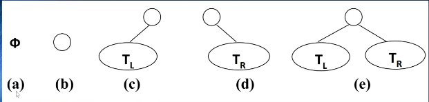
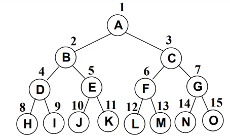
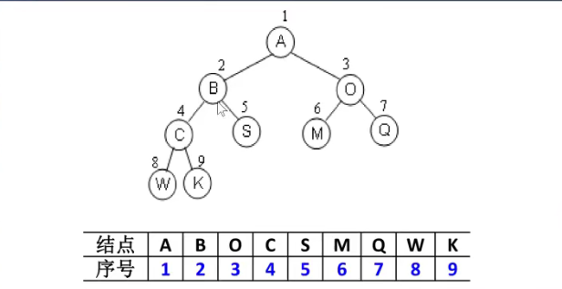
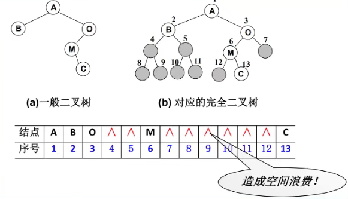
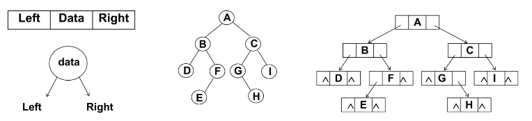
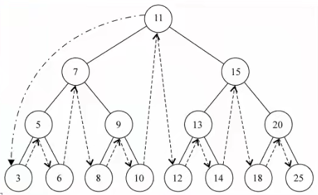
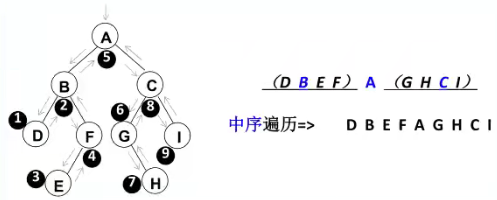
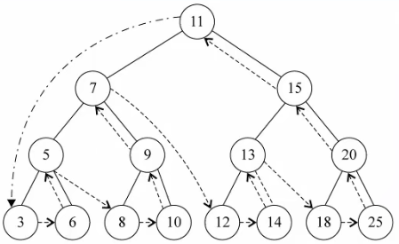
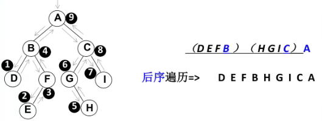
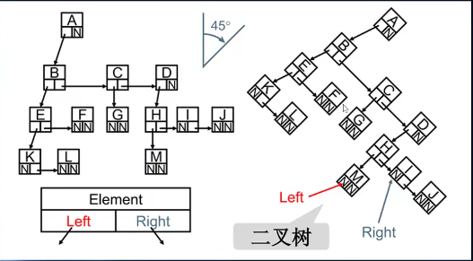

# 1. 树结构
## 1.1. 树结构的优点
为什么要使用树结构来保存数据呢？
树结构和数组/链表/哈希表对比有什么优点？

#### 数组/链表/哈希表优缺点总结
##### 数组：
- 优点：
数组的主要优点是根据下标值访问效率会很高
但是如果我们希望根据元素来查找对应的位置，比较好的方式是先对数组进行排序，再进行二分查找
- 缺点：
需要点对数组进行排序，生成有序数组，才能提高查找效率
另外数组在插入和删除数据时，需要有大量的位移操作，效率很低

##### 链表：
- 优点：
链表的插入和删除操作效率很高
- 缺点：
查找效率很低，需要从头开始依次访问链表中的每个数据项，直到找到
而且即使插入和删除操作效率很高，但是如果需要插入和删除中间位置的数据，还是需要从头先找到对应的数据
##### 哈希表：

- 优点：
哈希表的插入和查询、删除效率都很高
- 缺点：
  - 空间利用率不高，底层使用的是数组，并且某些单元是没有被利用的
  - 哈希表中的元素是无序的，不能按照固定的顺序来遍历哈希表中的元素
  - 不能快速的找出哈希表中的最大值和最小值这些特殊的值

##### 树结构
- 效率仅次于上面的哈希表
- 数据是有序的
- 可以查找最值
- 结构是非线性的，可以表示一对多的关系

## 1.2. 数结构的术语
- 树(Tree)：n>0个节点构成的有限集合
  - 当n=0时，称为空树
- 对于任何 一颗非空树，它具备以下性质：
  - 树中有一个被称为根（Root）的特殊节点，用r表示
  - 其余的节点可分为m(m>0)个互不相交的有限集T1，T1,T3,...,Tm,其中每个集合本身又是一棵树，称为原来树的“子树”（SubTree）
- 节点的度（Degree）：节点的子树个数
- 树的度：树的所有节点中国最大的度数
- 叶节点：度为0的节点（也称为叶子节点）
- 路径和路径长度：从节点n1到nk的路径为一个节点序列n1,n2,n3,...,nk,ni是ni+1的父节点。路径所包含边的个数为路径的长度
- 节点的层次（Level)：规定根节点在1层，其他任意节点的层数是其父节点的层数加1
- 数的深度（Depth）：树中所有节点中最大层次是这颗数的深度

## 1.3. 数结构的普通表示方式


## 1.4. 二叉树
> 如果树中每个节点最多只能有两个子节点，这样的树就称为“二叉树”

### 1.4.1. 二叉树的定义：
- 二叉树可以为空，也就是没有节点
- 若不为空，则它是由根节点和称为其左子树TLhe右子树TR的两个不相交的二叉树组成
- 二叉树有五种形态：
  

### 1.4.2. 完美二叉树
完美二叉树（Perfect Binary Tree），也称为满二叉树（Full Binary Tree)
- 在二叉树中，除了最下面一层的叶节点外，每层节点都有2个子节点，就构成了满二叉树


### 1.4.3. 完全二叉树
完全二叉树(Complete Binary Tree)
- 除了二叉树最后一层从左到右的叶节点连续存在，只缺右侧若干节点
- 完美二叉树是特殊的完全二叉树


### 1.4.2. 二叉树的特性

- 一个二叉树第i层的最大节点树为：2^(i-1),i>=1
- 深度为k的二叉树有最大节点总数为：2^k-1,K>=1
- 对于任何非空二叉树T，若n0表示叶节点的个数，n2是度为2的非叶节点的个数，那么两者满足关系n0=n2+1
### 1.4.3. 二叉树的存储
二叉树的存储常见的形式是数组和链表

#### 使用数组
##### 完全二叉树：
按从上至下，从左至右顺序存储

##### 非完全二叉树：
非完全二叉树要转成完全二叉树才可以按照上面的方案存储
但是会有很大的空间浪费



#### 使用链表
二叉树最常见的方式还是使用链表存储
每个节点都封装成一个Node，Node中包含存储的数据，左节点的引用，右节点的引用


### 1.4.4. 二叉搜索树
二叉搜索树(BST,Binary Search Tree)，也称为二叉排序树或者二叉查找树
- 二叉搜索树是一颗二叉树，可以为空；
- 如果不为空，满足以下性质：
  - 非空左子树的所有键值小于其根节点的键值
  - 非空右子树的所有键值大于其根节点的键值
  - 左右子树本身也都是二叉搜索树

二叉搜索树的特点：
- 相对较小的值总是保存在左节点上，相对较大的值总是保存在右节点上
- 二叉搜索树的查找效率非常高

#### 二叉搜索树的封装

#### 二叉搜索树常见操作
- insert(key):插入新值
- search(key):查找一个键，如果节点存在，返回true,不存在，返回false
- inOrderTraverse:
- preOrderTraverse:
- postOrderTraverse:
- min:
- max:
- remove(key):

#### 遍历二叉搜索树
这里学的树的遍历，针对所有的二叉树都是适用的不仅仅是二叉搜索树

二叉树的遍历常见的有三种方式：
- 先序遍历
- 中序遍历
- 后序遍历
- 还有层序遍历，使用较少，可以使用队列来完成

#### 先序遍历
遍历过程：
1. 访问根节点
2. 先序遍历其左子树
3. 先序遍历其右子树

#### 中序遍历
遍历过程：
1. 中序遍历其左子树
2. 访问根节点
3. 中序遍历其右子树





#### 后序遍历
遍历过程：
1. 后序遍历其左子树
2. 后续遍历其右子树
3. 访问根节点




#### 最大值&最小值

#### 搜索特定的值

#### 二叉搜索树的删除
删除节点要从查找要删的节点开始，找到节点后，需要考虑三种情况：
- 该节点是叶节点（没有子节点，比较简单）
- 该节点有一个子节点（也相对简单）
- 该节点有两个子节点（情况比较复杂）

##### 情况一：没有子节点
这种情况相对比较简单，我们需要检测current 的left以及right是否都为null
都为null之后还要检测一个东西，就是是否current就是根，都为null,并且为根，那么相当于要清空二叉树
否则就要把父节点的left或者right字段设置为null即可 

##### 情况二：有一个子节点
要删除的current节点，只有2个连接（如果有两个子节点，就是三个连接了），一个连接父节点，一个连接唯一的子节点
需要从这三者之间：爷爷-自己-儿子，将自己（current）剪短，让爷爷直接连接儿子即可
这个过程需要改变父节点的left或者right，指向要删除节点的子节点
当然，在这个过程中还要考虑是否current就是根

##### 情况三：有两个子节点
 如果我们要删除的节点有两个子节点，甚至子节点还有子节点，这种情况我们需要从下面的子节点中找到一个节点，来替换当前的节点

 但是找到的这个节点有什么特征呢？应该是current节点下面所有节点中最接近current节点的
 - 要么比current节点小一点点
 - 要么比current节点大一点点

这个节点怎么找呢？
- 比current小一点点的节点，一定是current左子树的最大值
- 比current大一点点的节点，一定是current右子树的最小值

###### 前驱&后继
在二叉搜索树中，这两个特别的节点，有两个特别的名字：
- 比current小一点点的节点，称为current节点的前驱
- 比current大一点点的节点，称为current节点的后继

也就是为了能够删除有两个子节点的current,要么要找到它的前驱，要么要找到它的后继


#### 二叉搜索树封装代码
```js
 // 封装二叉搜索树
function BinarySearchTree() {
    function Node(key) {
        this.key = key
        this.left = null
        this.right = null
    }

    // 属性
    this.root = null


    // 方法

    // 1. 插入数据
    BinarySearchTree.prototype.insert = function (key) {
        // 1. 根据key创建节点
        var newNode = new Node(key)

        // 2. 判断根节点是否有值
        if (this.root == null) {
            this.root = newNode
        } else {
            this.insertNode(this.root, newNode)
        }
    }

    BinarySearchTree.prototype.insertNode = function (node, newNode) {
        if (newNode.key < node.key) { //向左查找
            if (node.left == null) {
                node.left = newNode
            } else {
                this.insertNode(node.left, newNode)
            }
        } else { //向右查找
            if (node.right == null) {
                node.right = newNode
            } else {
                this.insertNode(node.right, newNode)
            }
        }
    }

    // 树的遍历
    // 1. 先序遍历
    BinarySearchTree.prototype.preOrderTraversal = function (handler) {
        this.preOrderTraversalNode(this.root, handler)
    }

    BinarySearchTree.prototype.preOrderTraversalNode = function (node, handler) {
        if (node != null) {
            // 1. 处理经过的节点
            handler(node.key)

            // 2. 查找经过节点的左子节点
            this.preOrderTraversalNode(node.left, handler)

            // 3. 查找经过节点的右子节点
            this.preOrderTraversalNode(node.right, handler)
        }
    }

    // 2. 中序遍历
    BinarySearchTree.prototype.midOrderTraversal = function (handler) {
        this.midOrderTraversalNode(this.root, handler)
    }

    BinarySearchTree.prototype.midOrderTraversalNode = function (node, handler) {
        if (node != null) {
            // 查找我们的左子树的节点
            this.midOrderTraversalNode(node.left, handler)
            // 2. 处理节点
            handler(node.key)
            // 3.查找右子树的节点
            this.midOrderTraversalNode(node.right, handler)
        }
    }


    // 3. 后序遍历
    BinarySearchTree.prototype.postOrderTraversal = function (handler) {
        this.postOrderTraversalNode(this.root, handler)
    }

    BinarySearchTree.prototype.postOrderTraversalNode = function (node, handler) {
        if (node != null) {
            // 1. 查找左子树中的节点
            this.postOrderTraversalNode(node.left, handler)

            // 2.查找右子树中的节点
            this.postOrderTraversalNode(node.right, handler)

            // 3.处理节点
            handler(node.key)
        }

    }


    // 寻找最值

    // 1. 寻找最大值
    BinarySearchTree.prototype.max = function () {
        // 1. 获取根节点
        var node = this.root

        // 2. 依次向右不断的查找，直到节点为null
        var key = null
        while (node != null) {
            key = node.key
            node = node.right
        }

        return key
    }


    // 2. 寻找最小值
    BinarySearchTree.prototype.min = function () {
        // 1. 获取根节点
        var node = this.root
        // 2. 依次向左不断查找，直到节点为Null
        var key = null
        while (node !== null) {
            key = node.key
            node = node.left
        }

        return key
    }


    // 搜索某一个key
    BinarySearchTree.prototype.search = function (key) {
        // 1. 获取根节点
        var node = this.root

        // 2. 循环搜索key
        while (node != null) {
            if (key < node.key) {
                node = node.left
            } else if (key > node.key) {
                node = node.right
            } else {
                return true
            }
        }
        return false
    }

    // 删除节点
    BinarySearchTree.prototype.remove = function (key) {
        // 1. 寻找要删除的节点
        // 1.1. 定义变量，保存一些信息
        var current = this.root
        var parent = null
        var isLeftChild = true

        // 1.2. 开始寻找删除的节点
        while (current.key != key) {
            parent = current
            if (key < current.key) {
                isLeftChild = true
                current = current.left
            } else {
                isLeftChild = false
                current = current.right
            }


            // 某种情况：已经找到了最后的节点,依然没有找到==key
            if (current == null) {
                return false
            }
        }

        // 2. 根据对应的情况删除节点
        // 2.1. 删除的节点时叶子节点
        if (current.left == null && current.right == null) {
            // 删除的节点时根节点，而且根节点是叶子节点
            if (current == this.root) {
                this.root = null
            } else if (isLeftChild) {
                parent.left = null
            } else {
                parent.right = null
            }
        }

        // 2.2. 删除的节点有一个子节点
        else if (current.right = null) {
            if (current == this.root) {
                this.root = current.left
            } else if (isLeftChild) {
                parent.left = current.left
            } else {
                parent.right = current.left
            }
        } else if (current.left == null) {
            if (current == this.root) {
                this.root = current.right
            } else if (isLeftChild) {
                parent.left = current.right
            } else {
                parent.right = current.right
            }
        }
        // 删除节点有两个子节点的情况待补充
        else {
            // 1. 获取后继节点
            var successor = this.getSuccessor(current)

            // 2. 判断是否是根节点
            if (current == this.root) {
                this.root = successor
            } else if (isLeftChild) {
                parent.left = successor
            } else {
                parent.right = successor
            }

            // 3. 将删除节点的左子树=current.left
            successor.left = current.left

        }
    }


    BinarySearchTree.prototype.getSuccessor = function (delNode) {
        // 1. 定义变量，保存找到的后继
        var successor = delNode
        var current = delNode.right
        var successorParent = delNode

        // 2. 循环查找
        while (current != null) {
            successorParent = successor
            successor = current
            current = current.left
        }
        // 3. 判断寻找的后继节点是否直接就是delNode的right节点
        if (successor != delNode.right) {
            successorParent.left = successor.right
            successor.right = delNode.right
        }
        return successor
    }
}
```


## 1.5. 儿子-兄弟表示法旋转

其实所有的树本质上都可以用二叉树模拟出来



