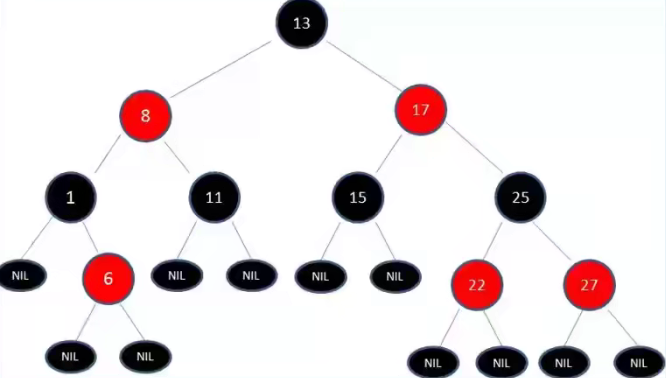

# 1. 红黑树
## 1.1. 二叉搜索树的缺陷
插入有序的数据时，二叉树左右分布就会容易变得不平衡

## 1.2. 非平衡树：
- 比较好的二叉搜索树数据应该是左右分布均匀的
- 但是插入连续数据后，分布的不均匀，我们称这种树是非平衡树
- 对于一课平衡二叉树来说，插入/查找等操作的效率是O(logN)
- 对于一棵非平衡二叉树，相当于编写了一个链表，查找效率变成了O(N)

## 1.3. 树的平衡性
为了能以较快的时间来操作一棵树，我们需要保证树总是平衡的
也就是说树中每个节点左边的子孙节点的个数，应该尽可能的等于右边的子孙节点的个数

### 常见的平衡树
- AVL树：
  - 每个节点多储存了一个额外的数据
  - 插入和删除的操作相对于红黑树效率不高，所以整体效率不如红黑树

- 红黑树：
  - 插入删除等操作性能优于AVL树，平衡树的应用基本上都是红黑树

## 1.4. 红黑树的规则
红黑树，除了符合二叉搜索树的基本规则之外，还添加了一些特性：
- 节点时红色或者黑色
- 根节点是黑色
- 每个叶节点都是黑色的空节点（NIL节点）
- 每个红色节点的两个子节点都是黑色。（从每个叶子到根的所有路径上不能有两个连续的红色节点）
- 从任一节点到其每个叶子的所有路径都包含相同数目的黑色节点

## 1.5. 红黑树的相对平衡
红黑树的特性：
从根到叶子的最长可能路径，不会超过最短可能路径的两倍长
结果就是这个树基本上述平衡的

为什么可以做到最长路径不超过最短路径的两倍呢？
性质4决定了路径不能有两个相连的红色节点
最短的可能路径都是黑色节点
最长的路径是红色和黑色交替
性质5所有路径都有相同的数目的黑色节点
这就表明了没有路径能多余任何其他路径的两倍长

## 1.6. 变色
插入一个新节点时，有可能树不再平衡，可以通过三种方式的变换，让树保持平衡：换色-左旋转-右旋转
- 变色：为了重新符合红黑树的规则，尝试把红色节点变为黑色，或者把黑色节点变为红色
  首先，需要知道插入的新的节点通常都是红色节点
  因为在插入节点为红色的时候，有可能插入一次是不违反红黑树的任何规则的
  而插入黑色节点，必然会导致有一条路径上多了黑色节点，这是很难调整的
  红色节点可能导致出现红红相连的情况，但是这种情况可以通过颜色调换和旋转来调整

- 旋转
  - 左旋转：逆时针旋转红黑树的两个节点，使得父节点被自己的右孩子取代，而自己成为自己的左孩子
  
  - 右旋转：顺时针旋转红黑树的两个节点，使得父节点被自己的左孩子取代，而自己成为自己的右孩子
  
 

## 1.7. 插入操作
讨论一下插入的情况：
设要插入的节点为N，其父节点为P
其祖父节点为G,其父亲的兄弟节点为U（即P和U是同一个节点的子节点）

##### 情况一：
新节点N位于树的根上，没有父节点
这种情况，我们直接将红色换为黑色即可，这样满足性质2

##### 情况二：
新节点的父节点P是黑色
- 性质4没有失效（新节点时红色的），性质5也没有任何问题
- 尽管新节点N有两个黑色的叶子节点nil,但是新节点N是红色的，所以通过它的路径中的黑色节点个数依然相同，满足性质5

##### 情况三：
P为红色，U也是红色
父红叔红祖黑->父黑叔黑祖红

操作方案：
将P和U变换为黑色，并且将G变换为红色
现在新节点N有了一个黑色的父节点P，所以每条路径上黑色节点的数目没有改变
而从更高的路径上，必然都会经过G节点，所以那些路径的黑色节点数目也是不变的，符合性质5

可能出现的问题：
但是N的祖父节点G的父节点也可能是红色，这样就违反了性质3，可以递归的调整颜色
但是如果递归调整颜色到了根节点，就需要进行旋转了

##### 情况四：
父红叔黑祖黑N是左儿子-->父黑祖红右旋转

操作方案：
对祖父节点G进行依次右旋转
在旋转产生的树中，以前的父节点P现在是根节点以及以前祖父节点G的父节点
交换以前的父节点P和祖父节点G的颜色（P为黑色，G变成红色）
B节点向右平移，称为G节点的左子节点

##### 情况五：
N的叔叔U是黑色节点，且N是有孩子
父红叔黑祖黑，N是右儿子-->以P为根左旋转，将P作为新插入的红色节点考虑即可-->自己变成hies

操作方案：
对P节点进行依次左旋转，形成情况四的结果
对祖父节点G进行一次右旋转，并且改变颜色即可

