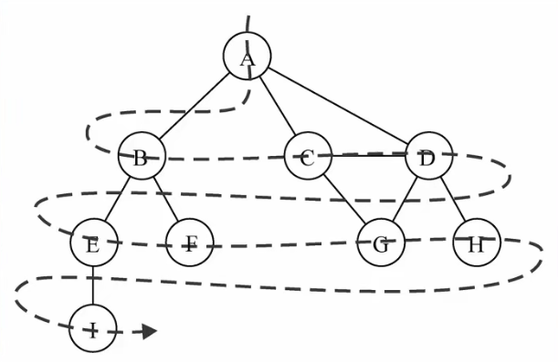
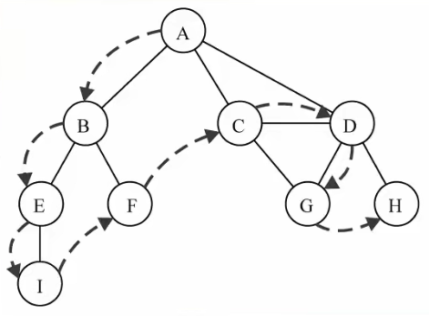

# 1. 图论
## 1.1. 什么是图
- 图结构是一种与树结构有些相似的数据结构
- 图论是数学的一个分支，并且在数学概念上，树是图的一种
- 它以**图形**为研究对象，研究**顶点**和**边**组成的图形的数学理论和方法
- 主要的研究目的是事物之间的关系，顶点代表事物，边代表两个事物间的关系

## 1.2. 图的特点
- 一组顶点：通常用V(Vertex)表示顶点的集合
- 一组边：通常用E(Edge)表示边的集合
  - 边是顶点和顶点之间的连线
  - 边可以是有向的，也可以是无向的
  - 比如A--B通常表示无向，A-->B通常表示有向

## 1.3. 图的术语
- 顶点：表示图中的一个节点
- 边：表示顶点和顶点之间的连线
  - 注意这里的边不叫路径，路径有其他的概念
- 度:一个顶点的度是**相邻顶点的数量**
- 路径：路径是顶点v1,v2,...,vn的一个连续序列
  - 简单路径：简单路径要求不包含重复的顶点
  - 回路：第一个顶点和最后一个顶点相同的路径称为回路
- 无向图：所有的边都没有方向
- 有向图：图中的边是有方向的
- 无权图：边没有携带权重，图中的边没有任何意义
- 带权图：边有一定的权重
  - 权重可以是任意你希望表示的数据
  - 比如距离或者花费的时间或者票价等等

## 1.4. 图的表示
图中包含的信息：顶点和边
- 顶点：使用ABCD来表示
  - 这些ABCD可以使用一个数组存储起来
  - ABCD中可能包含其他含义的数据

- 边：因为边是两个顶点之间的关系，表示起来会相对麻烦一点
### 1.4.1. 邻接矩阵
邻接矩阵是一种比较常见的表示图的方式
- 邻接矩阵让每个节点和一个整数相关联，该整数作为数组的下标值
- 我们用一个二维数组来表示顶点之间的连接
- 例如：[0][2]表示A->C之间的连接

- 图片解析
  - 二维数组中，0表示没有连线，1表示有连线
  - 通过二维数组，我们可以很快地找到一个顶点和哪些顶点有连线
  - 另外，A-A,B-B等（也就是顶点到自己的连线）通常使用0表示

邻接矩阵的问题：
如果图是一个稀疏图，那么矩阵中将存在大量的0，这意味着我们浪费了计算机存储空间来表示根本不存在的边

### 1.4.2. 邻接表
邻接表是另外一种常用的表示图的方式
- 邻接表由图中每个顶点以及和顶点相邻的顶点列表组成
- 这个列表有很多种方式来存储：数组/链表/字典（哈希表）都可以


图片解析：
例如我们要表示和A顶点有关联的顶点（边），A和B/C/D有边
那么我们可以通过A找到对应的数组/链表/字典，再取出其中的内容就可以了

邻接表的问题：
- 邻接表计算出度是比较简单的（出度：指向别人的数量，入度：别人指向自己的数量）
- 如果需要计算有向图的“入度”，那么是一件非常麻烦的事
- 它必须构造一个“逆邻接表”，才能有效计算“入度”，但是开发中“出度”相对用的比较少

## 1.5. 图结构封装
```html
<script>
    // 封装图结构
    function Graph() {
        //属性
        // 顶点：使用数组
        this.vertexes = []
        // 边：使用字典
        this.edges = new Dictionary()

        //方法

        // 添加方法
        // 1. 添加顶点的方法
        Graph.prototype.addVertex = function (v) {
            this.vertexes.push(v)
            this.edges.set(v, [])
        }

        // 2. 添加边的方法
        // 添加边的方法
        Graph.prototype.addEdge = function (v1, v2) {
            this.edges.get(v1).push(v2)
            this.edges.get(v2).push(v1)
        }

        // 实现toString方法
        Graph.prototype.toString = function () {
            // 1. 定义字符串，保存最终的结果
            var resultString = ''

            // 2. 遍历所有的顶点，以及顶点对应的边
            for (var i = 0; i < this.vertexes.length; i++) {
                resultString += this.vertexes[i] + '->'
                var vEdges = this.edges.get(this.vertexes[i])
                for (var j = 0; j < vEdges.length; j++) {
                    resultString += vEdges[j] + ' '
                }
                resultString += '\n'
            }
            return resultString
        }
    }

    //  测试代码
    // 1. 创建图结构
    var g = new Graph()

    // 2. 添加顶点
    var myVertexes = ['A', 'B', 'C', 'D', 'E', 'F', 'G', 'H', 'I']
    for (var i = 0; i < myVertexes.length; i++) {
        g.addVertex(myVertexes[i])
    }

    // 3. 添加边
    g.addEdge('A', 'B')
    g.addEdge('A', 'C')
    g.addEdge('A', 'D')
    g.addEdge('C', 'D')
    g.addEdge('C', 'G')
    g.addEdge('D', 'G')
    g.addEdge('D', 'H')
    g.addEdge('B', 'E')
    g.addEdge('B', 'F')
    g.addEdge('E', 'I')


    // 4. 测试结果
    alert(g)
</script>
```

## 1.6. 图的遍历
图的遍历意味着需要将图中每个顶点访问一遍，并且不能有重复的访问

有两种算法可以对图进行遍历：
- 广度优先搜索（Breadth-First Search,简称BFS）
- 深度优先搜索（Depth-First Search，简称DFS）

两种遍历算法，都需要明确指定第一个被访问的顶点
### 1.6.1. 遍历的思想
两种算法的思想：
- BFS：基于队列，入队列的顶点先被探索
- DFS：基于栈或者使用递归，通过将顶点存入栈中，顶点是沿着路径被探索的，存在的新的相邻顶点就去访问

为了记录顶点是否被访问过，我们使用三种颜色来反映他们的状态：
- 白色：表示该顶点还没有被访问
- 灰色：表示该顶点被访问过，但是并未被探索过
- 黑色：表示该顶点被访问过且被完全探索过

### 1.6.2. 广度优先搜索
广度优先搜索算法的思路：
- 广度优先算法会从指定的第一个顶点开始遍历图，先访问其所有的相邻点，就像一次访问图的一层
- 换句话说，就是先宽后深的访问顶点



广度优先搜索的实现：
- 创建一个队列
- 将V标注为被发现的灰色，并将V加入队列Q
- 如果Q非空，执行下面的步骤：
  - 将V从Q中取出队列
  - 将V标注为被发现的灰色
  - 将V所有的未被访问过的邻接点（白色）加入到队列中
  - 将V标注为黑色

```js
 // 实现广度优先搜索(BFS)
Graph.prototype.bfs = function (initV, handler) {
    // 1. 初始化颜色
    var colors = this.initializeColor()

    // 2. 创建队列
    var queue = new Queue()

    // 3. 将顶点加入队列中
    queue.enqueue(initV)

    // 4. 循环从队列中取出元素
    while (!queue.isEmpty()) {
        // 4.1. 从队列中取出一个顶点
        var v = queue.dequeue()

        // 4.2. 获取和顶点相连的另外顶点
        var vList = this.edges.get(v)

        // 4.3. 将v的颜色设置为灰色
        colors[v] = 'gray'

        // 4.4. 遍历所有的顶点，并且加入到队列中
        for (var i = 0; i < vList.length; i++) {
            var e = vList[i]
            if (colors[e] == 'white') {
                colors[e] = 'gray'
                queue.enqueue(e)
            }
        }

        // 4.5. 访问顶点
        handler(v)

        // 4.6. 将顶点设置为黑色
        colors[v] = 'black'
    }
}
```

### 1.6.3. 深度优先搜索
深度优先搜索的思路：
- 深度优先搜索算法将会从第一个指定的顶点开始遍历图，沿着路径直到这条路径的最后被访问了
- 接着原路回退并探索下一条路径



深度优先算法的实现：
- 广度优先算法我们使用的是队列，这里可以使用栈完成，也可以使用递归
- 方便代码书写，使用递归

```js
// 深度优先搜索实现(DFS)
Graph.prototype.dfs = function (initV, handler) {
    // 1. 初始化颜色
    var colors = this.initializeColor()

    // 2. 从某个顶点开始递归访问
    this.dfsVisit(initV,colors,handler)
}
Graph.prototype.dfsVisit = function (v, colors, handler) {
        // 1. 将颜色设置为灰色
        colors[v] = 'gray'

        // 2. 处理v顶点
        handler(v)

        // 3. 访问v相连的其他顶点
        var vList = this.edges.get(v)
        for (var i = 0; i < vList.length; i++) {
            var e = vList[i]
            if (colors[e] == 'white') {
                this.dfsVisit(e, color, handler)
            }
        }

        // 4. 将v设置成黑色
        colors[v] = 'black'
    }
```