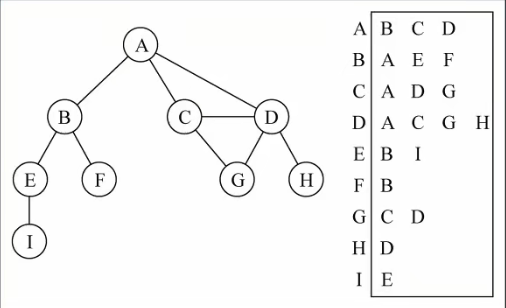

# 1. 图论
## 1.1. 什么是图
- 图结构是一种与树结构有些相似的数据结构
- 图论是数学的一个分支，并且在数学概念上，树是图的一种
- 它以**图形**为研究对象，研究**顶点**和**边**组成的图形的数学理论和方法
- 主要的研究目的是事物之间的关系，顶点代表事物，边代表两个事物间的关系

## 1.2. 图的特点
- 一组顶点：通常用V(Vertex)表示顶点的集合
- 一组边：通常用E(Edge)表示边的集合
  - 边是顶点和顶点之间的连线
  - 边可以是有向的，也可以是无向的
  - 比如A--B通常表示无向，A-->B通常表示有向

## 1.3. 图的术语
- 顶点：表示图中的一个节点
- 边：表示顶点和顶点之间的连线
  - 注意这里的边不叫路径，路径有其他的概念
- 度:一个顶点的度是**相邻顶点的数量**
- 路径：路径是顶点v1,v2,...,vn的一个连续序列
  - 简单路径：简单路径要求不包含重复的顶点
  - 回路：第一个顶点和最后一个顶点相同的路径称为回路
- 无向图：所有的边都没有方向
- 有向图：图中的边是有方向的
- 无权图：边没有携带权重，图中的边没有任何意义
- 带权图：边有一定的权重
  - 权重可以是任意你希望表示的数据
  - 比如距离或者花费的时间或者票价等等

## 1.4. 图的表示
图中包含的信息：顶点和边
- 顶点：使用ABCD来表示
  - 这些ABCD可以使用一个数组存储起来
  - ABCD中可能包含其他含义的数据

- 边：因为边是两个顶点之间的关系，表示起来会相对麻烦一点
### 1.4.1. 邻接矩阵
邻接矩阵是一种比较常见的表示图的方式
- 邻接矩阵让每个节点和一个整数相关联，该整数作为数组的下标值
- 我们用一个二维数组来表示顶点之间的连接
- 例如：[0][2]表示A->C之间的连接

- 图片解析
  - 二维数组中，0表示没有连线，1表示有连线
  - 通过二维数组，我们可以很快地找到一个顶点和哪些顶点有连线
  - 另外，A-A,B-B等（也就是顶点到自己的连线）通常使用0表示

邻接矩阵的问题：
如果图是一个稀疏图，那么矩阵中将存在大量的0，这意味着我们浪费了计算机存储空间来表示根本不存在的边

### 1.4.2. 邻接表
邻接表是另外一种常用的表示图的方式
- 邻接表由图中每个顶点以及和顶点相邻的顶点列表组成
- 这个列表有很多种方式来存储：数组/链表/字典（哈希表）都可以

图片解析：
例如我们要表示和A顶点有关联的顶点（边），A和B/C/D有边
那么我们可以通过A找到对应的数组/链表/字典，再取出其中的内容就可以了

邻接表的问题：
- 邻接表计算出度是比较简单的（出度：指向别人的数量，入度：别人指向自己的数量）
- 如果需要计算有向图的“入度”，那么是一件非常麻烦的事
- 它必须构造一个“逆邻接表”，才能有效计算“入度”，但是开发中“出度”相对用的比较少

## 1.5. 图结构封装
