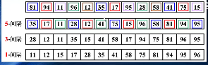
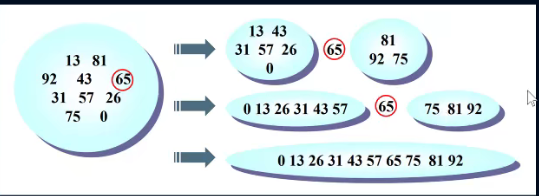

# 1. 大O表示法
在数据项个数发生改变时，算法的效率会跟着发生改变
所以我们通常使用一种算法的速度会跟着数据量变化而变化的表示方法

## 1.1. 常见的大O表示形式
- O(1):常数级
- O(log(n)):对数级
- O(n):线性的
- O(nlog(n)):线性和对数乘积
- O(n^2)：平方
- o(2^n):指数级

推导大O表示法的方式：
- 用常量1取代运行时间中所有的加法常量
- 在修改后的运行次数函数中，只保留最高阶项
- 如果最高存在且不为1，则去除与这个项相乘的常数

# 2. 排序算法
## 2.1. 认识排序算法
排序算法非常多：
- 冒泡排序
- 选择排序
- 插入排序
- 归并排序
- 计数排序
- 基数排序
- 希尔排序
- 堆排序
- 桶排序
- ...

在这里不一一列举实现思想，选择几个简单排序和高级排序介绍：
- 简单排序
  - 冒泡排序
  - 选择排序
  - 插入排序
- 高级排序
  - 希尔排序
  - 快速排序

## 2.2. 封装列表
在开始排序前，我们先来创建一个列表封装我们的数据项
```js
// 创建列表类
function ArrayList() {
    //属性
    this.array = []

    //方法

    // 将数组可以插入到数组中的方法
    ArrayList.prototype.insert = function (item) {
        this.array.push(item)
    }

    // toString方法
    ArrayList.prototype.toString=function(){
        return this.array.join('-')
    }
}
```
## 2.3. 冒泡排序
冒泡排序的思路：
- 对未排序的各元素从头到尾依次比较相邻的两个元素大小关系
- 如果左边的队员高，则两队员交换位置
- 向右移动一个位置，比较下面两个队员
- 当走到最右端时，最高的队员一定被放在了最右边
- 按照这个思路，从最左端重新开始，这次走到倒数第二个位置的队员即可
- 以此类推，就可以将数据排序完成


### 2.3.1. 代码实现
```js
// 冒泡排序
ArrayList.prototype.bubblesort = function () {
    // 1. 获取数组的长度
    var length = this.array.length
    // 第一次：j=length-1，比较到倒数第一个位置
    // 第二次：j=length-2，比较到倒数第2个位置
    // 以此类推
    for (var j = length - 1; j >= 0; j--) {
        for (var i = 0; i < j; i++) {
            // 第一次进来：i=0,比较0和1位置的两个数据，如果0位置上的数据比较大，交换两个数据的位置
            if (this.array[i] > this.array[i + 1]) {
                //交换两个数据的位置
                // var temp = this.array[i]
                // this.array[i] = this.array[i + 1]
                // this.array[i + 1] = tmep
                this.swap(i, i + 1)
            }
        }
    }
}
```
### 2.3.2. 冒泡排序的效率

- 冒泡排序的比较次数：
  - 对于N个数据项的比较次数：(N-1)+(N-2)+(N-3)+...+1=N*(N-1)/2
  - 所以冒泡排序比较次数的大O表示法为O(N^2)
- 冒泡排序的交换次数：
  - 如果有两次比较才需要交换一次（不可能每次比较都交换一次），那么交换次数为N^2/4
  - 由于常量不算在大O表示法中，因此，我们可以认为交换次数的大O表示也是O(N^2)

## 2.4. 选择排序
选择排序改进了冒泡排序：
- 将交换的次数有O(N^2)减少到了O(N)
- 但是比较的次数依然是O(N^2)

选择排序的思路：
1. 选定第一个索引位置，然后和后面元素依次比较
2. 如果后面的队员小于第一个索引位置的队员，则交换位置
3. 经过一轮的比较后，可以确定第一个位置是最小的
4. 然后使用同样的方法把剩下的元素逐个比较即可
5. 可以看出选择排序，第一轮会选出最小值，第二轮会选出第二小的值，直到最后


### 2.4.1. 代码实现
```js
ArrayList.prototype.selectionSort = function () {
    // 1. 获取数组的长度
    var length = this.array.length


    // 2. 外层循环：从0位置开始取数据
    var min=0
    for (var j=0;j<length-1;j++){
    //    内层循环：从I+1位置开始和后面比大小
        var min=j
    for(var i=min+1;i<length;i++){
        if(this.array[min]>this.array[i]){
            min=i
        }
    }
    this.swap(m,j)
    }
}
```

### 2.4.2. 选择排序都效率

- 选择排序的比较次数：
  - 选择排序和冒泡排序的比较次数：N*(N-1)/2
  - 大O表示法：O(N^2)
- 选择排序的交换次数：
  - 选择排序每次进行选择的时候，最多需要交换1次，一共遍历多少次呢？N-1次
  - 选择排序的交换次数只有N-1次，用大O表示法就是O(N)
  - 选择排序在执行效率上是优于3冒泡排序的


## 2.5. 插入排序
 插入排序是简单排序中效率最好的一种
 插入排序也是学习其他高级排序的基础


 局部有序：
 插入排序的思想的核心是局部有序什么是局部有序呢？
 比如在一个队列中的人，我们选择其中一个作为标记的队员
 这个被标记的队员左边的所有队员已经是局部有序的
 这意味着有一部分人是按照顺序排列好的，有一部分还没有顺序

 插入排序的思路：
 1. 从第一个元素开始，该元素可以认为已经被排序
 2. 取出下一个元素，在已经排序的元素序列中从后向前扫描
 3. 如果该元素（已排序）大于新元素，将该元素移到下一位置
 4. 重复上一个步骤，直到找到以排序的元素小于或者等于新元素的位置
 5. 将新元素插入到该位置后，重复上面的步骤


### 2.5.1. 插入排序代码实现
```js
ArrayList.prototype.insertionSort = function () {
    // 1. 获取数组长度 
    var length = this.array.length

    // 2. 外层循环：从第一个位置获取数据，向前面局部有序进行插入
    for (var i = 1; i < length; i++) {
        // 3. 内层循环，获取i位置的元素，和前面的数据依次进行比较
        var temp = this.array[i]
        var j = i
        while (this.array[j - 1] > temp && j > 0) {
            this.array[j] = this.array[j - 1]
            j--
        }

        // 4. 将j位置的数据，放置temp 就可以
        this.array[j]=temp
    }

}
```

### 2.5.2. 插入排序的效率


 - 插入排序的比较次数：
  - 第一趟时，需要的最多次数是1，第二趟最多次数是2，依次类推，最后一趟是N-1次
  - 因此插入排序的最多次数：1+2+3+...+N-1=N*(N-1)/2
  - 然而每趟发现插入点之前，平均只有全体数据项的一半需要进行比较
  - 我们可以除以2得到N*(N-1)/4，所以相对于选择排序，比较次数是少了一半的

- 插入排序的复制次数：
   - 第一趟时，需要最复制次数是1，第二趟最多是2，最后一趟是N-1
   - 因此复制次数最多是1+2+3+...+N-1=N*(N-1)/2


## 2.6. 希尔排序
希尔排序是插入排序的一种高效的改进版，效率比插入排序更快

插入排序的问题：
- 假设一个很小的数据项在很靠近右端的位置上，这里本来应该是较大的数据项的位置
- 把这个小数据项移到左边的正确位置，所有的中间数据项都必须向右移动一位
- 如果每个步骤对数据项都进行N次复制，平均下来是移动N/2,N 个元素就是N*N/2=N^2/2
- 所以我们通常认为插入效率是O(N^2)
- 如果有某种方式，不需要一个个移动所有中间的数据项，就能把较小的数据项移动到左边，那么这个算法的执行效率会有很大的改进

### 2.6.1. 希尔排序的思路

比如下面的数字：81,94,11,96,12,35,17,95,28,58,41,75,15

我们先让间隔为5，进行排序：(35,81),(94,17),(11,95),(96,28),(12,58),(35,41),(17,75),(95,15)

排序后的新序列，一定可以让数字里自己的正确位置更近一步

我们再让间隔为3，进行排序：(35,28,75,58,95),(17,12,15,81),(11,41,96,94)

排序后的新序列，一定可以让数字离自己的正确位置又近了一步

最后我们让间隔为1，也就是正确的插入排序



### 2.6.2. 希尔排序的代码实现
```js
// 希尔排序

ArrayList.prototype.shellSort = function () {
    // 1. 获取数组的长度 
    var length=this.array.length

    // 2. 初始化的增量
    var gap=Math.floor(length/2)

    // 3. while循环 gap不断减小
    while(gap>=1){
        // 4. 以gap作为间隔进行分组，对分组进行插入排序
        for(var i=gap;i<length;i++){
            var temp=this.array[i]
            var j=i
            while(this.array[j-gap]>temp &&j>gap-1){
                this.array[j]=this.array[j-gap]
                j-=gap
            }
            
        // 5. 将j位置的元素赋值temp
        this.array[j]=temp
              
        }
        // 6. 增量变化 

        gap=Math.floor(gap/2)
    }

}
```


### 2.6.3. 希尔排序的效率
经过统计，希尔排序使用原始增量，最坏的情况下时间复杂度为O(n^2),通常情况下都要好于O(N^2)

希尔排序的大多数情况下都高于简单排序
甚至在合适的增量和某些数量N的情况下，还要好于快速排序


## 2.7. 快速排序
快速排序几乎可以说是目前所有排序算法中，最快的一种排序算法

希尔排序相当于插入排序的升级版，快速排序其实是冒泡排序的升级版
- 冒泡排序需要进行很多次交换，才能在一次循环中，将最大值放在正确的位置
- 快速排序可以在一次循环中（其实是递归调用），找出某个元素的正确位置，并且该元素之后不需要进行任何移动
- 快速排序最重要的思想是分而治之

比如我们有下面这样一些数字需要排序：


1. 从其中选出65（其实可以选择任意数字）
2. 我们通过算法：将所有小于65的数字放在65的左边，将所有大于65的数字放在65的右边
3. 递归处理左边的数据（比如选择31来处理左侧）递归处理右侧的数据（比如选择75来处理右侧）
4. 最终：完成排序

### 2.7.1. 快速排序的枢纽
在快速排序中有一个很重要的步骤就是选取枢纽（pivit也有人称为主元）

一种比较优秀的解决方案是：取头中尾的中位数
  


### 2.7.2. 快速排序的代码实现
```js
// 快速排序

// 1. 选择枢纽
ArrayList.prototype.median = function (left, right) {
    // 1.取出中间的位置
    var center = Math.floor((left + right) / 2)

    // 2. 判断大小，并进行交换
    if (this.array[left] > this.array[center]) {
        this.swap(left, center)
    }
    if (this.array[center] > this.array[right]) {
        this.swap(center, right)
    }
    if (this.array[left] > this.array[center]) {
        this.swap(left, center)
    }
    // if(this.array[center]<this.array[left]&&this.array[cneter]<this.array[right]){
    //     this.swap(center,left)
    // }


    // 将center换到right-1的位置
    this.swap(center, right - 1)

    return this.array[right - 1]
}


// 2. 快速排序的实现
ArrayList.prototype.quickSort = function () {
    this.quick(0, this.array.length - 1)

}

ArrayList.prototype.quick = function (left, right) {
    // 1. 结束条件
    if (left >= right) return

    // 2. 获取枢纽
    var pivot = this.median(left, right)


    // 3.定义变量用于记录当前找到的位置
    var i = left
    var j = right - 1

    // 4. 开始进行交换循环
    while (i<j) {
        while (this.array[++i] < pivot) {

        }
        while (this.array[--j] > pivot) {}


        if(i<j){
            this.swap(i,j)
        }else{
            break
        }
    }

    // 6. 将枢纽放置在正确的位置，i的位置
    this.swap(i,right-1)

    // 7. 分而治之
    this.quick(left,i-1)
    this.quick(i-1,right)

}
}
```
### 2.7.3. 快速排序的效率
快速排序的最坏情况效率
在每次选择的枢纽都是最左边或者最右边的情况下，快速排序效率最坏，这时的效率等同于冒泡排序

快速排序的平均效率：
快速排序的平均效率是O(N*logN)
